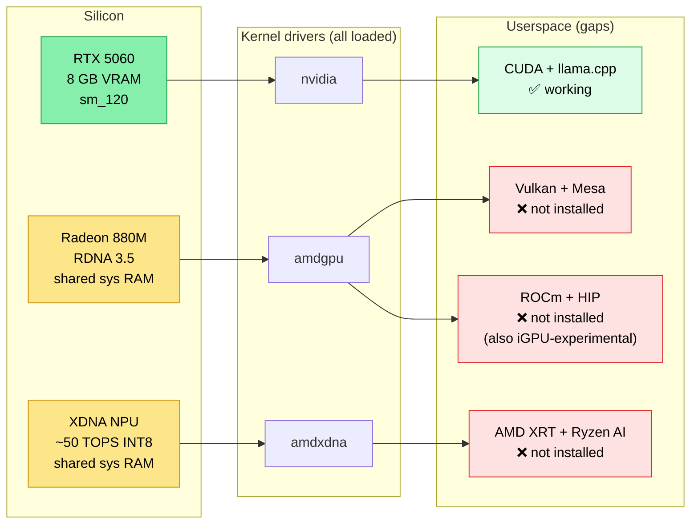
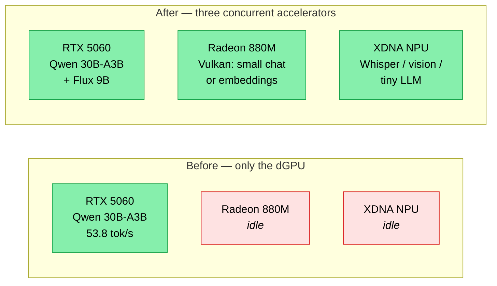

# Beyond CUDA — using the iGPU, NPU, and ROCm on this laptop

> Companion to [LESSONS_LEARNED.md §5.5](LESSONS_LEARNED.md), which says the Radeon 880M iGPU and XDNA NPU are "idle" under the CUDA-only llama.cpp build. **They are. But they don't have to be.** This file documents what it takes to wake them up.

This is a *separate workload* document — none of this affects the existing CUDA path for Qwen / Phi / Flux on the RTX 5060. Think of the iGPU and NPU as bonus accelerators sitting next to the discrete GPU, available for *parallel* small-model workloads (vision, audio, lightweight LLM, embedding) while the RTX is busy with the main job.

---

## 1. Hardware inventory — what's actually on the silicon

Confirmed on this laptop (Ubuntu 26.04, kernel 7.0, May 2026):

| Accelerator | PCI slot | Device | Kernel driver | Userspace status |
|---|---|---|---|---|
| **NVIDIA RTX 5060 Laptop** | 05:00.0 | `card1` | `nvidia` | ✅ used (CUDA path) |
| **AMD Radeon 880M iGPU** (Strix RDNA 3.5) | 06:00.0 | `card2`, `renderD128` | `amdgpu` (loaded) | ❌ no userspace tools yet |
| **AMD XDNA NPU** (Ryzen AI 9 365, ~50 TOPS) | 07:00.1 | `/dev/accel/accel0` | `amdxdna` (loaded) | ❌ no userspace runtime yet |

**Important** — the kernel side is **fully ready** on all three. The bottleneck is the userspace toolchain. That's a fixable problem, not a hardware constraint.



---

## 2. The iGPU — Radeon 880M (RDNA 3.5)

The iGPU shares system RAM (no dedicated VRAM). It can't outrun the RTX 5060 — but it doesn't have to. **It can run a small model in parallel with the RTX**, freeing the discrete GPU for heavy work.

There are two userspace stacks for compute on the iGPU. Pick one (mixing is non-trivial).

### Path A: Vulkan (recommended for hobbyist concurrent inference)

**What it is**: a graphics API that also exposes compute kernels. llama.cpp has a mature Vulkan backend (`-DGGML_VULKAN=ON`). Mesa's RADV driver implements Vulkan on AMD GPUs out of the box on Linux.

**Why it's the right fit on this laptop**:
- Works on RDNA 3.5 today, no version-pinning gymnastics
- Low setup overhead (~50 MB of packages)
- Good llama.cpp support; many small models run well
- Doesn't conflict with CUDA (Vulkan kernels live in the iGPU; CUDA in the dGPU)

**Setup**:

```bash
sudo apt install -y mesa-vulkan-drivers vulkan-tools

# Verify the iGPU is exposed via Vulkan
vulkaninfo --summary
# Expected: a section showing "AMD Radeon Graphics (RADV STRIX)"
# alongside (or instead of) the NVIDIA card.
```

**Build llama.cpp with Vulkan support** (separate build dir; do NOT replace the CUDA build):

```bash
cd ~/workspace/projects/all-about-ai/llm-inference/build/llama.cpp
cmake -B build-vulkan \
    -DGGML_VULKAN=ON \
    -DCMAKE_BUILD_TYPE=Release \
    -DLLAMA_CURL=ON
cmake --build build-vulkan --config Release -j $(nproc)
```

The CUDA build at `build-cuda/bin/llama-server` keeps working. The Vulkan build at `build-vulkan/bin/llama-server` runs alongside on a different port.

**Run a small model on the iGPU**:

```bash
cd build-vulkan/bin
LD_LIBRARY_PATH=. ./llama-server \
    -m ~/workspace/models/qwen3-8b/Qwen3-8B-Q4_K_M.gguf \
    -ngl 99 \
    -c 4096 \
    --host 127.0.0.1 --port 8082    # ← different port from CUDA build
```

**Force iGPU selection** if Vulkan picks the wrong device (e.g., the dGPU's Vulkan side):

```bash
GGML_VK_VISIBLE_DEVICES=1 ./llama-server ...
# index 0/1 depends on enumeration order — `vulkaninfo --summary` shows the order
```

**Realistic expectations** on the Radeon 890M (Strix iGPU, ~3 TFLOPS FP16, system-RAM bandwidth ~80 GB/s):
- Qwen 3 0.6B: very fast, real-time chat speed (untested but well in range)
- Qwen 3 4B: usable (~10-20 tok/s, projected)
- Qwen 3 8B: **better than expected — 15.2 tok/s measured** (see §2.5)
- Phi-4 14B dense fits fully (uses 8.4 of 15.8 GB iGPU UMA) but is slow (~8 tok/s) — bandwidth-bound
- Qwen 3 30B-A3B MoE with `-ncmoe 31`: surprisingly viable at 23.8 tok/s — MoE patterns mute the bandwidth disadvantage
- Dense > 14B: not the right tool — the dGPU+offload path beats it even when it has to spill heavily

### 2.5 Measured iGPU benchmarks (May 2026, this laptop)

Built `build-vulkan/` next to `build-cuda/` from the same commit (`50494a2`). Same `llama-bench` recipe (`-p 512 -n 128 -r 2`), same GGUFs, just `--device Vulkan1` targeting the Radeon 890M.

| Model | Size | CUDA path (5060) | iGPU path (Vulkan 890M) | iGPU slowdown |
|---|---:|---|---|---:|
| Qwen 3 8B Q4_K_M | 4.7 GB | `-ngl 99` → **pp 2263 / tg 63.7** | `-ngl 99` → pp 232 / **tg 15.2** | **4.2× tg** |
| Phi-4-reasoning 14B Q4_K_M | 8.4 GB | `-ngl 35` (partial offload) → pp 969 / **tg 23.8** | `-ngl 99` (all on iGPU) → pp 119 / **tg 8.2** | **2.9× tg** |
| Qwen3.6-27B Q3_K_M | 12.6 GB | `-ngl 33` (heavy offload) → pp 343 / **tg 7.8** | `-ngl 99` (all on iGPU) → pp 65 / **tg 5.2** | **1.5× tg** |
| Qwen 3 30B-A3B MoE Q4_K_M | 17.3 GB | `-ngl 99 -ncmoe 31` → pp 599 / **tg 53.8** | `-ngl 99 -ncmoe 31` → pp 203 / **tg 23.8** | **2.3× tg** |

**Three lessons from this table:**

1. **The iGPU never wins on this laptop — not even on models that fit its larger UMA but bust the dGPU's VRAM.** Phi-4 14B fits fully in the 890M's 15.8 GB. The dGPU has to spill 5 of 40 layers to CPU. The dGPU+spill still wins 2.9×. Lesson: GDDR6 bandwidth on the discrete card beats DDR5-shared-with-CPU even when the discrete card is doing extra work.

2. **The gap shrinks dramatically for MoE.** For dense models the iGPU is 3–4× slower; for the 30B-A3B MoE the gap drops to 2.3×. Because most of an MoE's weights are *cold experts that live in RAM regardless of which GPU is driving*, both paths read mostly from the same DDR5 bus — and the gap narrows to whatever the active-path advantage is.

3. **15.2 tok/s on the iGPU for an 8B model is actually useful**, given the iGPU pulls ~5–10 W vs ~50–80 W for the dGPU under load. Real use case: chat-quality model on battery, or a small concurrent helper while CUDA does heavy work.

### When would the iGPU win? Not on *this* laptop

The math: the iGPU's pp512/tg128 ratio is dominated by DDR5 system bandwidth, which is **~80 GB/s shared with the CPU**. The 5060's VRAM is **~448 GB/s, private**. That's a 5.6× bandwidth gap before any other factor. No amount of memory headroom flips that.

A **Strix Halo** chip (Ryzen AI Max+ 395) has the *same iGPU lineage* but ships with LPDDR5X-8000 quad-channel ≈ **256 GB/s** unified memory and no discrete GPU at all. On that machine the iGPU is the fast path. **Architecture matters more than the iGPU label.**

Best uses on this laptop:
- **Embeddings** (BGE, E5) — hundreds per second
- **Quote-verifier helper LLM** (Phi-3-mini class) at high throughput
- **Vision models** like Moondream2 / SmolVLM — small, RAM-friendly
- **Concurrent small chat** while the dGPU runs Flux or 30B+ MoE

### Path B: ROCm + HIP (more powerful, more friction on iGPUs)

**What it is**: AMD's CUDA-equivalent stack. Targets discrete AMD GPUs primarily; iGPU support is **experimental** for Strix Point / RDNA 3.5.

**Setup** (Ubuntu 26.04 ships ROCm 6.x in the repos):

```bash
sudo apt install -y rocm-dev rocminfo rocm-smi rocm-opencl-icd
sudo usermod -a -G render,video $USER  # required for /dev/dri access
# log out + back in for group changes to take effect

rocminfo | head -30
# Expected: lines mentioning "gfx1150" (RDNA 3.5) or "gfx1151" for the iGPU
```

**Likely friction**:
- ROCm officially supports only specific `gfxNNNN` targets. RDNA 3.5 (`gfx1150`/`gfx1151`) may not be in the supported list — workaround is `HSA_OVERRIDE_GFX_VERSION=11.0.0` to force-pretend the iGPU is RDNA 3 (`gfx1100`).
- Build llama.cpp with `cmake -B build-rocm -DGGML_HIP=ON -DCMAKE_HIP_ARCHITECTURES=gfx1100 …`
- Some kernels may crash; quality varies by op.

**When ROCm is worth the friction**: if you later swap in a discrete AMD GPU (RX 7900 XTX, etc.). On the Strix iGPU alone, **Vulkan is generally easier and just as fast or faster**.

### Recommendation for this laptop's iGPU

**Use Vulkan.** Same hardware, less setup, fewer things to break. Reach for ROCm only when you genuinely need HIP-only ops (rare in inference).

---

## 3. The NPU — AMD XDNA 2 (~50 TOPS, INT8)

> **2026-05 update**: We installed and benchmarked the NPU. **The standalone [NPU.md](NPU.md) is the canonical doc** — full install (one `.deb` + memlock tweak, no reboot), measured numbers (Qwen 3 0.6 B at **92.6 tok/s @ ~+10 W**, dGPU idle), embedding throughput, gotchas, and reproducible scripts. The section below remains as the historical orientation; for what to actually run, jump to NPU.md.


The NPU is fundamentally different from the iGPU/dGPU:
- Fixed-function INT8 matrix multiply blocks (not general-purpose compute)
- ~50 TOPS at INT8 — competitive with the dGPU on the *right* model
- Power-frugal — runs in laptop battery without spinning fans
- **Does not run GGUFs.** Models must be quantized to INT8 in ONNX format and compiled to NPU-specific binaries.

The kernel device `/dev/accel/accel0` is already exposed via `amdxdna`. What's missing is the userspace.

### Setup

```bash
# AMD-Xilinx unified Runtime (XRT) for the NPU
sudo apt install -y libxrt-npu2 libxrt-utils-npu python3-xrt

# Add yourself to the render group (NPU device permissions)
sudo usermod -a -G render $USER
# log out + back in for group changes to take effect

# Verify the NPU is reachable
xrt-smi examine
# Expected: a section showing your XDNA NPU, vendor 0x1022, device 0x17F0
```

### Running models on it

The NPU runs ONNX models with INT8 quantization, compiled for the XDNA target. Two practical entry points:

**Option 1 — onnxruntime + VitisAI Execution Provider** *(the path AMD's Ryzen AI Software uses)*:

```bash
pip install onnxruntime-vitisai  # AMD's NPU EP for onnxruntime
```

```python
import onnxruntime as ort
sess = ort.InferenceSession(
    "model_int8.onnx",
    providers=[("VitisAIExecutionProvider", {"config_file": "vaip_config.json"})],
)
```

You'd typically use AMD's [Ryzen AI Software](https://ryzenai.docs.amd.com/) examples — they pre-compile a few popular models (Llama-3-8B Instruct, Phi-3-mini, Whisper, etc.) for the NPU.

**Option 2 — directly via XRT Python bindings** (for custom XDNA kernels — rarely needed):

```python
import pyxrt
device = pyxrt.device(0)
xclbin = pyxrt.xclbin("compiled_kernel.xclbin")
device.load_xclbin(xclbin)
```

### Realistic NPU use cases on this laptop

The NPU is *not* a drop-in for general LLM inference. It shines at:

| Workload | NPU fit | Notes |
|---|---|---|
| **Whisper** ASR (speech-to-text) | ✅ Excellent | AMD provides Whisper-large-v3 + smaller variants compiled for XDNA |
| **Vision models** (Moondream, ResNet, ViT) | ✅ Good | Most CNNs/ViTs port cleanly to INT8 ONNX |
| **Small LLMs** (Phi-3-mini, Llama-3-8B INT4-INT8) | ✅ Good | Compiled by AMD; runs at ~30-50 tok/s |
| **Mixture of Experts** | ❌ Poor | XDNA isn't built for sparse routing |
| **Big LLMs** (30B+) | ❌ Poor | Not enough on-NPU memory; would streaming, slow |
| **Image generation** (Flux, SD) | ⚠️ Limited | Some U-Net stages port; full Flux pipeline not yet |
| **Embeddings** (BGE, E5) | ✅ Excellent | Tiny models, INT8-friendly |

### Practical gotchas

- **AMD Ryzen AI Software is Windows-first.** Linux support exists in the `amdxdna` kernel driver (which we have!) and the `onnxruntime-vitisai` package, but documentation is thinner than the Windows path. Expect to read AMD's GitHub issues.
- **Each NPU model needs a separate compile step** with AMD's Vitis tools — you don't just point at any ONNX file. AMD distributes pre-compiled bundles for popular models.
- **NPU + dGPU concurrent use is fine** — they share system RAM but have separate compute paths. Battery friendliness drops if both are active.

---

## 4. What this means for the projects on this laptop

### `llm-inference` (this repo)

The LLM benchmarks here will continue to live entirely in the CUDA + CPU path — that's where the daily-driver work happens (Qwen 30B-A3B at 53.8 tok/s, etc.). But this repo can now **also** publish numbers for:

- Same models on **Vulkan iGPU** — for the small-model tier (Qwen 3 4B, Phi-3-mini)
- **NPU benchmarks** for Whisper, Phi-3-mini, embedding models
- **Concurrent inference**: dGPU running 30B-MoE *while* iGPU/NPU runs a 1B helper model

That's a meaningful expansion of the BENCHMARKS table — same methodology, three accelerators.

### `VideoBook / Comment Lab` (sibling project)

The Comment Lab pipeline currently uses sequential VRAM swap (Mind → Artist → Render). With the iGPU and NPU available, we can rethink:

- **Vision (Moondream2)** could move to the **NPU** (it's an INT8-friendly small model). That frees ~4 GB VRAM.
- **Embeddings** for the future "have I covered this trend already?" dedup feature could run on the **NPU** — fast and free of VRAM contention.
- **Quote verifier's web-search ranking** could use a small embedder on the **iGPU via Vulkan** — concurrent with the Mind LLM.
- The **dGPU** stays focused on Qwen 35B-A3B (Mind) and Flux 2 Klein 9B (Artist).

This isn't a v1 priority for Comment Lab — manual review + sequential VRAM works for the first 20 posts. But it's a clean v2 path: *each accelerator owns one phase concurrently, no swapping*.

---

## 5. Suggested install order (lightest → heaviest)

If you want to enable any of this, run these in order. Each step is independent — stop whenever you have what you need.

```bash
# 1. Vulkan (~50 MB, ~30 sec) — instant access to iGPU compute
sudo apt install -y mesa-vulkan-drivers vulkan-tools
vulkaninfo --summary

# 2. Render group (one-time; needed for ROCm and NPU)
sudo usermod -a -G render,video $USER
# log out + back in (or `newgrp render` for one shell)

# 3. NPU runtime (~80 MB)
sudo apt install -y libxrt-npu2 libxrt-utils-npu python3-xrt
xrt-smi examine

# 4. NPU Python provider (in a venv)
pip install onnxruntime-vitisai

# 5. ROCm — only if you want the HIP path (~3 GB)
sudo apt install -y rocm-dev rocminfo rocm-smi rocm-opencl-icd
rocminfo | head -30

# 6. Build llama.cpp Vulkan target (~2 min)
cd ~/workspace/projects/all-about-ai/llm-inference/build/llama.cpp
cmake -B build-vulkan -DGGML_VULKAN=ON -DCMAKE_BUILD_TYPE=Release -DLLAMA_CURL=ON
cmake --build build-vulkan -j $(nproc)
```

After step 1, Vulkan is alive. After step 4, the NPU can run AMD's pre-compiled ONNX models. After step 6, the iGPU is a usable second LLM target.

---

## 6. The bigger picture

The marketing line on this laptop is "70 TOPS NPU + 8 GB dGPU + 50 TFLOPS iGPU". The reality, **with software as it stands today**, is that most workflows light up only one of those at a time. The CUDA path on the dGPU is mature and fast; the iGPU and NPU paths are real but require a deliberate setup pass.

What the work in this document buys you:



For a single-user laptop running creative AI workflows, that's a meaningful capacity boost — especially for pipelines like Comment Lab where vision, ASR, embedding, and main LLM can all run concurrently if each lands on the right silicon.

---

## 7. Open questions / TODO

1. ~~**Benchmark Qwen 3 4B and Phi-3-mini on Vulkan**~~ → **Done in §2.5** (covers 8B / 14B dense / 27B dense / 30B-A3B MoE — the right size range was different from what we initially guessed). Open: Qwen 3 4B and Phi-3-mini specifically, for the smallest size tier.
2. **Test concurrent dGPU + iGPU inference** — does running Qwen 30B-A3B on CUDA *and* a 4B model on Vulkan share the system DRAM gracefully, or do bandwidth fights tank both? With both paths reading from DDR5, the answer probably depends on how much the CUDA path is actually offloading per token.
3. **NPU LLM + embedding benchmarks** → **Done.** See [NPU.md](NPU.md). XDNA userspace installed via FastFlowLM v0.9.41 (kernel module was already loaded since Linux 7.0). Numbers: Qwen 3 0.6B at 92.6 tok/s decode @ +10 W, Qwen 3 8B at 10.9 tok/s, embed-gemma:300m at 5.3 embeds/s. dGPU stays idle. Open: **Whisper specifically** — still pending the NPU-compiled Whisper-v3 from AMD.
4. **NPU model porting workflow** — figure out how to take a Hugging Face ONNX model (e.g., a small LLM) and compile it for XDNA without using AMD's Windows-first GUI tools.
5. **Power draw with all three running** — laptop battery sustains how long?

Each of these is a follow-up benchmark for `BENCHMARKS.md`. PRs welcome.
