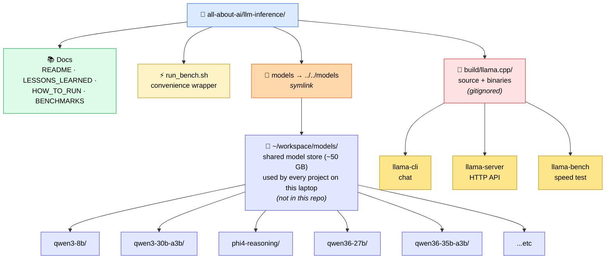
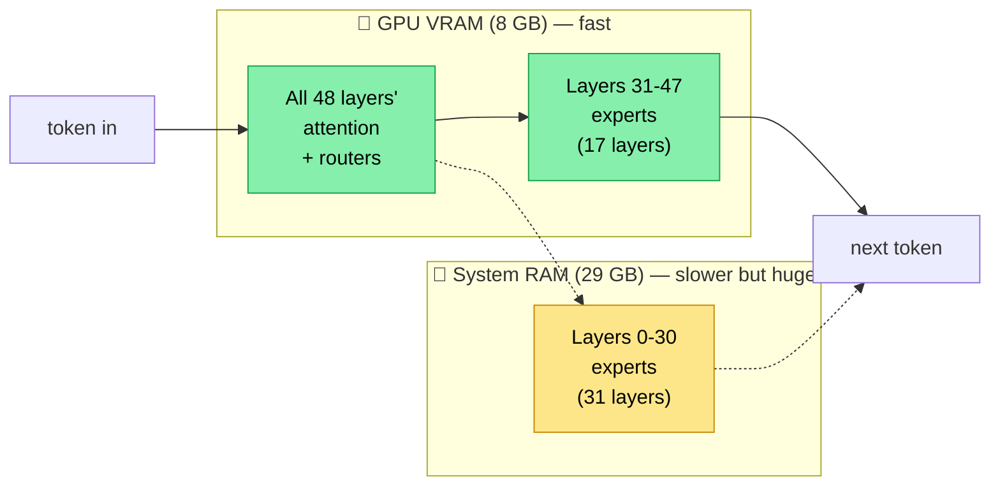
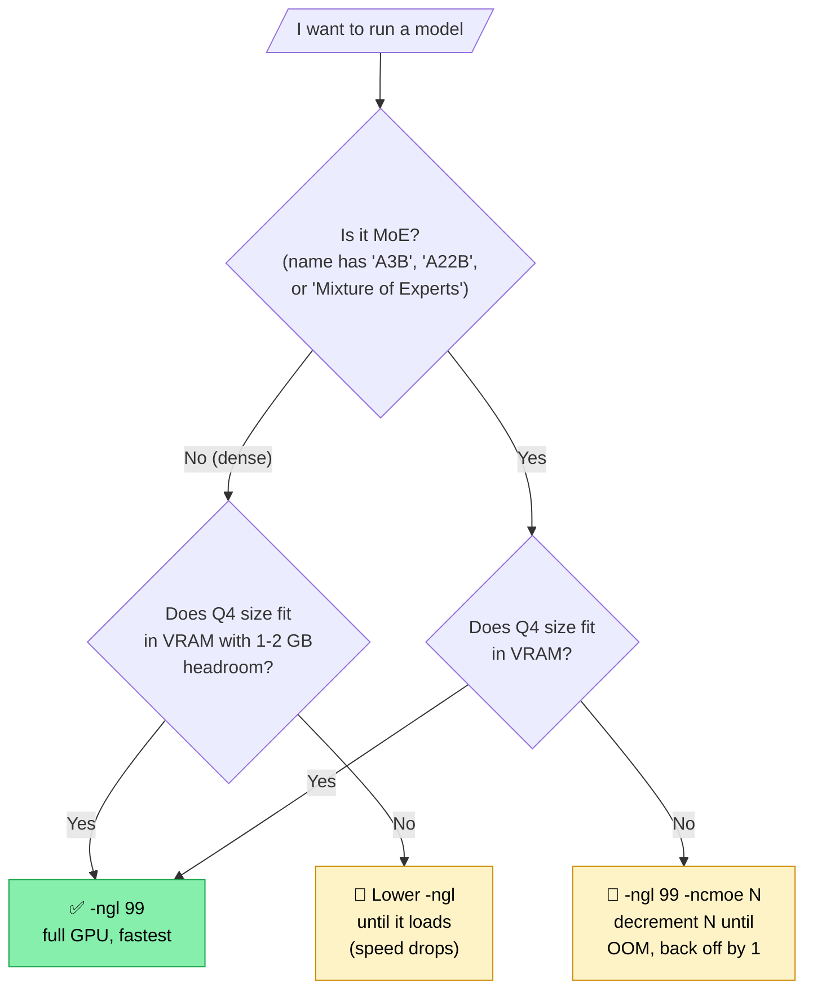

# How to Run & Test LLMs on This Laptop — A Hands-On Tutorial

A practical companion to `LESSONS_LEARNED.md` (which covers the *why*). This file is the *how*: copy-paste commands, what each command does, and what to do when things go wrong.

If you're new to this: read `LESSONS_LEARNED.md` first for the theory (kitchen analogy, MoE, quantization, KV cache). Then come back here.

---

## 0. Map of the project — where things live



### Why models live in `~/workspace/models/` (not inside the project)

Model weights are big (a single GGUF is 5–20 GB) and slow to download. Multiple projects on this laptop will want the same models — putting them in one shared place means we don't keep re-downloading them.

The path you'll see throughout this doc — `/home/ubuntu/workspace/models/qwen3-8b/...` — is the **canonical** location. The project also has a `models/` symlink that points there, so commands that reference `models/...` (relative) or the absolute `~/workspace/models/...` both resolve to the same files.

The `.gitignore` excludes both `models/` (the symlink target gets walked through) and direct GGUF/weight extensions, so weights never end up in the repo.

The binaries live deep inside `build/llama.cpp/build-cuda/bin/`. To run them you need:
1. To `cd` into that directory (or run with absolute paths), and
2. `LD_LIBRARY_PATH=.` (so the shared libraries `libllama.so`, `libggml-cuda.so`, etc. are found).

We'll add a shortcut for this in §3.

---

## 1. The big idea — what the binaries do

llama.cpp is one program shipped as several small executables, each doing one job:

| Binary | What it does | Analogy |
|---|---|---|
| `llama-cli` | Interactive chat in your terminal | Like talking to ChatGPT in a text window |
| `llama-server` | Starts an HTTP server with an OpenAI-compatible API | Like running your own local OpenAI |
| `llama-bench` | Runs a fixed-prompt benchmark and prints tok/s | Like a speed test for the model |
| `llama-perplexity` | Measures how "good" the model is on a text dataset | Like a final exam for the model |

The model file (`.gguf`) is the brain — same brain, different programs put it to work in different ways.

---

## 2. Why we use these specific flags

Three flags do 90% of the work. Memorize what they mean:

### `-m <path>` — the model
Path to a `.gguf` file. Always required.

### `-ngl <N>` — number of GPU layers
A model has ~30–60 internal "layers" (think floors of a building). This flag tells llama.cpp how many to run on the GPU vs the CPU.
- `-ngl 0` → all layers on CPU (slow, no VRAM use)
- `-ngl 16` → first 16 layers on GPU, rest on CPU
- `-ngl 99` → all layers on GPU (fastest if it fits)

**Tuning rule**: start with `-ngl 99`. If it crashes with "out of memory," lower it (try 32, then 16, etc.) until it loads. The highest value that loads is your sweet spot.

### `-ncmoe <N>` — number of MoE expert sets to push to CPU
**Only matters for MoE models** like Qwen 3 30B-A3B. Lets you keep the small "active" parts of the model on the GPU while the big "expert" parts live in RAM.

**Tuning rule for MoE**: use `-ngl 99 -ncmoe N`. Start with N = total_layers (everything to CPU, safe), then *decrease* N until the next decrement crashes. Back off by 1 — that's your sweet spot.

### Other flags that come up
- `-p <N>` — prompt size in tokens for benchmarks (e.g. `-p 512`)
- `-n <N>` — number of tokens to generate (e.g. `-n 128`)
- `-c <N>` — context window size in tokens (default 4096; set higher for long chats)
- `-t <N>` — CPU threads (default = num cores; usually fine)

---

## 2.5 Picking the right quantization (which `.gguf` to download)

When you go to a Hugging Face GGUF repo (e.g. `unsloth/Qwen3.6-27B-GGUF`), you'll see a list of files:

```
Qwen3.6-27B-Q2_K.gguf       10.7 GB
Qwen3.6-27B-Q3_K_M.gguf     12.6 GB    ← what we benched
Qwen3.6-27B-Q4_K_M.gguf     16.8 GB
Qwen3.6-27B-Q5_K_M.gguf     19.5 GB
Qwen3.6-27B-Q6_K.gguf       22.5 GB
Qwen3.6-27B-Q8_0.gguf       28.6 GB
```

Same model — different compression levels. **Smaller file = less VRAM/RAM needed, but slightly worse output quality.**

### The full ladder

| Quant | Bits/weight | Size for a 27B model | Quality | When to use |
|---|---|---:|---|---|
| Q2_K | ~2.5 | 10.7 GB | Noticeable drop | Last resort. Reasoning suffers. |
| **Q3_K_M** | ~3.5 | 12.6 GB | Small, real drop | When Q4 won't fit your VRAM/RAM |
| **Q4_K_M** | ~4.5 | 16.8 GB | Sweet spot | **Universal default** — pick this if it fits |
| Q5_K_M | ~5.5 | 19.5 GB | Very good | When you have headroom |
| Q6_K | ~6 | 22.5 GB | Excellent | Quality-conscious + plenty of memory |
| Q8_0 | 8 | 28.6 GB | Indistinguishable from FP16 | Datacenter-class hardware |
| (FP16) | 16 | ~54 GB | Original | The unquantized reference |

**Rule of thumb at Q4_K_M**: model size in GB ≈ **0.6 × parameter count in B**.
- 7B → ~4.5 GB
- 14B → ~9 GB
- 27B → ~17 GB
- 70B → ~42 GB

### Picking for *this laptop* (8 GB VRAM + 29 GB RAM)

Walk through the question for each model:
1. Does **Q4_K_M** fit in VRAM with 1-2 GB headroom? → Pick Q4_K_M, run with `-ngl 99`.
2. Does Q4_K_M fit in your **VRAM + RAM** combined? → Still pick Q4_K_M, accept the offload speed cost.
3. If Q4_K_M is too big for VRAM+RAM combined → Drop to **Q3_K_M** (last realistic step).
4. If even Q3 doesn't fit → That model is just too big for this laptop.

Worked examples for the four models we benched:

| Model | Q4_K_M size | Fits VRAM (8 GB)? | Choice we made | Why |
|---|---:|---|---|---|
| Qwen 3 8B | 4.7 GB | ✅ yes | **Q4_K_M** | Default sweet spot |
| Qwen 3 30B-A3B | 17.3 GB | ❌ no, but RAM yes | **Q4_K_M** | MoE → most params are cold experts in RAM, this still flies |
| Phi-4-reasoning 14B | 8.4 GB | ❌ tight, partial offload | **Q4_K_M** | Best balance; ngl=35 fits |
| Qwen3.6-27B | 16.8 GB | ❌ no, weights overflow even with all of RAM | **Q3_K_M** | Q4 fits in RAM but leaves no room for KV cache + buffers |

### Why we picked Q3_K_M for the 27B

The math: Qwen3.6-27B at Q4_K_M is 16.8 GB. With 7.7 GB usable VRAM and 29 GB RAM, you have ~36 GB total memory pool — Q4 fits easily. *But* you also need:
- ~1-3 GB for KV cache (depending on context length)
- ~1-2 GB for compute buffers and the runtime
- Some headroom for the OS

Q4_K_M leaves you cutting it close. Q3_K_M (12.6 GB) gives ~4 GB more headroom for context + buffers — important when you want to use long context.

The quality difference between Q3_K_M and Q4_K_M is usually subtle for general chat. For a *trophy* run on a hardware-bound machine, Q3_K_M is the right call.

### How to actually download a specific quant

```bash
# Install the HF CLI (one-time)
pip install --user "huggingface_hub[cli]"

# Download just the Q4_K_M file from a repo
hf download unsloth/Qwen3-8B-GGUF \
    --include "*Q4_K_M*" \
    --local-dir ~/workspace/models/qwen3-8b

# Or for a specific quant of the 27B trophy
hf download unsloth/Qwen3.6-27B-GGUF \
    --include "*Q3_K_M*" \
    --local-dir ~/workspace/models/qwen36-27b
```

The `--include "*PATTERN*"` filter is what saves you 50+ GB of disk — the repo has every quant, you only want one.

---

## 3. Quick-start: chat with Qwen 3 8B

This is the smoke-test. The 8B fits entirely on the GPU and runs fast.

```bash
cd /home/ubuntu/workspace/projects/all-about-ai/llm-inference/build/llama.cpp/build-cuda/bin
LD_LIBRARY_PATH=. ./llama-cli \
  -m /home/ubuntu/workspace/models/qwen3-8b/Qwen3-8B-Q4_K_M.gguf \
  -ngl 99 \
  -c 8192
```

You'll get an interactive `>` prompt. Type a question and hit Enter. The model "thinks" then responds. After each reply it shows speed numbers like `[ Prompt: 311 t/s | Generation: 72 t/s ]`.

To exit: type `/exit` or press `Ctrl+C`.

### Speed expectations on this laptop
- **Prompt processing** (how fast it reads your input): hundreds to thousands of tok/s
- **Generation** (how fast it writes its reply): the number you watch — feels like typing speed
- 60+ tok/s = instant feel; 10–30 tok/s = like a fast typist; under 5 tok/s = slow

---

## 4. Benchmarking — how fast is it really?

Chat speed varies with your prompt. For an apples-to-apples number, use `llama-bench` with a fixed prompt.

### The simplest benchmark
```bash
cd /home/ubuntu/workspace/projects/all-about-ai/llm-inference/build/llama.cpp/build-cuda/bin
LD_LIBRARY_PATH=. ./llama-bench \
  -m /home/ubuntu/workspace/models/qwen3-8b/Qwen3-8B-Q4_K_M.gguf \
  -ngl 99 \
  -p 512 \
  -n 128
```

Output looks like:
```
| model            | size | params | backend | ngl |   test |     t/s |
|------------------|------|--------|---------|-----|--------|---------|
| qwen3 8B Q4_K_M  | 4.68 | 8.19B  | CUDA    | 99  | pp512  | 2263.24 |
| qwen3 8B Q4_K_M  | 4.68 | 8.19B  | CUDA    | 99  | tg128  |   63.70 |
```

Two rows per model:
- `pp512` = prompt-processing tok/s for a 512-token prompt
- `tg128` = token-generation tok/s when producing 128 tokens

`tg128` is the headline — that's what feels like chat speed.

### Convenience wrapper
There's a `run_bench.sh` in the project root for quick benchmarks:

```bash
cd /home/ubuntu/workspace/projects/all-about-ai/llm-inference
./run_bench.sh models/qwen3-8b/Qwen3-8B-Q4_K_M.gguf 99
```

The first arg is the model, the second is `-ngl` (defaults to 99 if omitted).

---

## 5. Running a model that doesn't fit your VRAM (the MoE trick)

This is the most important section in the whole document. If you only read one part, read this one. We're going to walk through *why* a 30-billion-parameter model can run on an 8 GB GPU at near-chat speed, layer by layer (literally).

### 5.1 What's actually inside a transformer model?

Forget "language model" for a minute. Here's what's *actually* in the file:

A transformer model is just a tall stack of identical "layers." Each layer does two jobs in sequence:

```
   Layer 5  ┌─ ATTENTION  ─┐  ┌─ FEED-FORWARD (FFN) ─┐
            │ (small)      │  │ (big — most of layer) │
   Layer 4  ├─ ATTENTION  ─┤  ├─ FEED-FORWARD (FFN) ─┤
            │ (small)      │  │ (big — most of layer) │
   Layer 3  ├─ ATTENTION  ─┤  ├─ FEED-FORWARD (FFN) ─┤
   ...      ...
```

- **Attention** = how each word looks at the other words around it. Small in parameter count.
- **FFN (Feed-Forward Network)** = the actual "thinking" pass. Big — typically **2/3 of every layer's parameters live here**.

For a 30B-parameter dense model, roughly 20B is FFN and 10B is attention. The FFN is where the weight goes.

### 5.2 What MoE changes

In a **dense** model, the FFN is one big network. Every token goes through every parameter.

In a **Mixture of Experts (MoE)** model, the FFN slot is replaced by *many small expert FFNs* + a tiny **router** that picks which experts to use for each token:

```
  Dense FFN (one path):
    [token] → [BIG FFN, 600M params]   (all 600M used every time)

  MoE FFN (many paths, only 1-2 active):
    [token] → [router] → [expert 1?]
                          [expert 2?]
                          [expert 3?]   (router picks ~2 of 8)
                          ...
                          [expert 8?]
              → only 2/8 of the FFN parameters get used per token
```

Qwen 3 30B-A3B has:
- **48 layers** (the floors)
- Each layer has **128 experts** in its FFN slot
- The router activates **8 experts per token**
- Active parameters per token: **~3 billion** out of 30 billion total

This is why the model is named "30B-**A3B**" — 30B total, A3B = "Active 3B."

### 5.3 The asymmetry that makes -ncmoe magic

Here's the part that should click and never un-click:

| Component | % of params | Where it gets used |
|---|---:|---|
| Attention (all 48 layers) | ~10% | **Every** token. Hot. |
| Router (all 48 layers) | <1% | **Every** token. Tiny but hot. |
| Expert FFNs (48 layers × 128 experts each) | ~89% | **Only the picked few** per token. Most are cold. |

So **~89% of the model is "cold" most of the time** — sitting there in case the router calls on it, but not actually doing math for the current token.

If you put this 89% on the **slow side** (system RAM, accessed over the PCIe bus), you only pay the slowness cost when an expert gets picked. If you put the 11% that's hot on the **fast side** (VRAM), it runs full-speed for every token.

That's the whole trick. **Hot stuff in fast memory, cold stuff in slow memory.**

### 5.4 What -ngl and -ncmoe actually do

llama.cpp gives you two knobs:

- **`-ngl N`** (number of GPU layers) — "put the first N layers on the GPU." Crude. Includes attention + experts together.
- **`-ncmoe N`** (n CPU MoE) — "for the first N layers, *only* the expert FFNs go on the CPU; attention stays on the GPU."

Together: `-ngl 99 -ncmoe N` means **"put everything on the GPU, except for the experts in the first N layers — those go to system RAM."**

Visualized for a 48-layer model with `-ngl 99 -ncmoe 31`:



Crucially: **all 48 layers' attention is on the GPU** (the green box). Only the experts split between fast and slow memory.

The "hot" 10% of the model gets full GPU treatment for every token. Only the 89% of cold experts spread between fast and slow memory based on whether they fit.

### 5.5 Why the speed barely drops

You'd expect "most of the model on CPU = CPU-speed." Why isn't it?

Because for any given token, the router only picks 8 experts out of 128 *per layer*. With 31 layers' experts on CPU and 17 on GPU, the math averages out to: most tokens still find their experts on the GPU some of the time, and the parts that hit CPU are small enough that the CPU/RAM bandwidth (DDR5 ~80 GB/s) is enough to push 3B active params per token quickly.

A dense 30B model would have to push **30 GB through whatever memory holds it** for every single token. An MoE 30B model only pushes **~3 GB through memory per token**. That's the speed math.

### 5.6 Step-by-step tuning walkthrough

Let's actually find your sweet spot. Run these in order, watching the `tg128` column.

**Step 1 — start safe** (everything to CPU; should always load):

```bash
cd /home/ubuntu/workspace/projects/all-about-ai/llm-inference/build/llama.cpp/build-cuda/bin
LD_LIBRARY_PATH=. ./llama-bench \
  -m /home/ubuntu/workspace/models/qwen3-30b-a3b/Qwen3-30B-A3B-Q4_K_M.gguf \
  -ngl 99 -ncmoe 48 -p 512 -n 128
```

You'll get a baseline tg128 (everything-CPU experts → maybe 30-something tok/s).

**Step 2 — pull experts toward GPU** by lowering `-ncmoe`:

```bash
... -ncmoe 36 ...   # 12 layers of experts now on GPU
... -ncmoe 33 ...
... -ncmoe 32 ...
... -ncmoe 31 ...   # ← measured 53.8 tok/s on this laptop
... -ncmoe 30 ...   # ← OOM crash on this laptop
```

Each step gives you more layers' experts on the GPU. Speed goes up. Eventually you'll hit "out of VRAM" — that's the wall.

**Step 3 — back off by 1**. The last value that *worked* is your sweet spot. Save it.

**On this laptop, Qwen 3 30B-A3B's sweet spot is `-ngl 99 -ncmoe 31` → 53.8 tok/s**.

### 5.7 How to predict the sweet spot for *other* MoE models

You don't have to start from scratch each time. Quick mental model:

1. **Find the layer count** of the model. Either in the HF model card, or run `llama-cli -m <model>` and read the "n_layer" line during load.
2. **Estimate GPU-able layers**: `(VRAM in GB - 2) / (model size in GB / total layers)`. The "-2" reserves headroom for KV cache and runtime buffers.
3. **`ncmoe`** = `total_layers - GPU-able_layers`.
4. **Test from that estimate** — try the predicted value, then ±2 around it.

Worked example for **Qwen 3 30B-A3B** (48 layers, ~17 GB at Q4_K_M):
- Per-layer cost: 17 / 48 ≈ 0.35 GB
- GPU-able: (7.7 - 2) / 0.35 ≈ 16 layers
- Predicted ncmoe: 48 - 16 = **32**
- Reality: 31 was best (got slightly more headroom than expected). Predicted within 1 — usable.

Worked example for **Qwen3.6-35B-A3B** (40 layers, ~22 GB at UD-Q4_K_M, hybrid attention):
- Per-layer cost: 22 / 40 ≈ 0.55 GB
- GPU-able: (7.7 - 2) / 0.55 ≈ 10 layers
- Predicted ncmoe: 40 - 10 = **30**
- Reality: ncmoe=29 OOMs, ncmoe=30 loads but is volatile, **ncmoe=34 is the actual fast plateau** (37.8 t/s). The predictor finds the OOM cliff, not the fastest stable point — you still need to walk back up a step or two when KV-cache and compute buffers crowd the GPU. *Lesson: predict the floor, then sweep for the plateau.*

Worked example for **Gemma 4 26B-A4B** (30 layers, ~16 GB at UD-Q4_K_M, **262K vocab**) — where the naive prediction fails:
- Per-layer cost: 16 / 30 ≈ 0.53 GB → predict GPU-able (7.7-2)/0.53 ≈ 10 layers → predicted ncmoe ≈ **20**
- Reality: ncmoe=20 **OOMs**, ncmoe=22 thrashes (11 t/s), and the sweet spot is **ncmoe=28** (28.7 t/s) — only *2* expert layers on GPU.
- Why the prediction is so far off: the per-layer estimate ignores the **fixed non-expert tensors**, and Gemma's 262K-token vocab makes the embedding + output matrices ~1 GB+ *each* at Q4. Those sit on the GPU before any expert does, so the real GPU budget for experts is tiny. *Lesson: when a model has a huge vocab (Gemma, some multilingual models), subtract ~2-3 GB of fixed overhead from your VRAM budget before estimating offload — or just start the sweep near ncmoe=total_layers and walk down carefully.*

### 5.8 What if it's a *dense* model that doesn't fit?

`-ncmoe` does nothing for dense models — they have no experts to offload separately. For dense models that overflow VRAM, you only have `-ngl <N>` to play with: lower N = more on CPU. The speed cost is much harsher than for MoE because the entire layer (attention *and* FFN) gets pushed to slower memory.

Example with **Phi-4-reasoning 14B** (40 layers, 8.4 GB at Q4_K_M, dense):
- ngl=99 → OOM (8.4 GB > 7.7 GB VRAM)
- ngl=35 → 23.8 tok/s ✅ sweet spot
- ngl=36 → OOM

You only get one knob, and the speed penalty for each layer pushed off-GPU is bigger than for MoE. This is exactly why MoE is so attractive for our laptop class.

### 5.9 Cheat sheet

| Model type | Knobs | Strategy |
|---|---|---|
| Small dense (fits VRAM) | `-ngl 99` | Just offload everything; done. |
| Big dense (overflows VRAM) | `-ngl <N>` | Binary search on N until you find the largest that loads. |
| Big MoE (overflows VRAM) | `-ngl 99 -ncmoe <N>` | Predict ncmoe from §5.7, then decrement until OOM, back off by 1. |

The decision flowchart:



That's the whole tuning game.

---

## 6. Long conversations — the `-c` flag

Default context is 4096 tokens (~3000 words). For longer chats:

```bash
LD_LIBRARY_PATH=. ./llama-cli \
  -m models/qwen3-8b/Qwen3-8B-Q4_K_M.gguf \
  -ngl 99 \
  -c 32768                 # 32K tokens
```

**Memory cost**: each token in context takes some KV cache memory. At 8K context this is small (~1 GB). At 256K context it can balloon to 16 GB.

**The TurboQuant fix** (covered in `LESSONS_LEARNED.md` §7): adds `--cache-type-k turbo3 --cache-type-v turbo3` to compress the KV cache 5× with near-lossless quality. We'll set this up in the trophy run for Qwen3.6-27B.

---

## 7. Server mode — talk to your model from any program

`llama-server` exposes an HTTP API compatible with the OpenAI SDK. Useful when you want to use your local model from VSCode, a Python script, or any other tool.

### Start the server
```bash
cd /home/ubuntu/workspace/projects/all-about-ai/llm-inference/build/llama.cpp/build-cuda/bin
LD_LIBRARY_PATH=. ./llama-server \
  -m /home/ubuntu/workspace/models/qwen3-8b/Qwen3-8B-Q4_K_M.gguf \
  -ngl 99 \
  -c 8192 \
  --host 0.0.0.0 --port 8080
```

It now listens on `http://localhost:8080`.

### Test it with curl
```bash
curl http://localhost:8080/v1/chat/completions \
  -H "Content-Type: application/json" \
  -d '{
    "messages": [{"role": "user", "content": "Why is the sky blue?"}],
    "max_tokens": 200
  }'
```

### Use it from Python
```python
from openai import OpenAI
client = OpenAI(base_url="http://localhost:8080/v1", api_key="not-needed")
resp = client.chat.completions.create(
    model="local",
    messages=[{"role": "user", "content": "Hello"}],
)
print(resp.choices[0].message.content)
```

The web UI also lives at `http://localhost:8080` if you open it in a browser.

---

## 7.5 TurboQuant — the long-context KV-cache compression demo

Stock llama.cpp already has good KV-cache quantization (`-ctk q8_0`, `-ctk q4_0`). But for the most aggressive savings, there's an experimental algorithm called **TurboQuant** (Google DeepMind, ICLR 2026) that compresses the KV cache to 2–4 bits per value with near-lossless quality. See `LESSONS_LEARNED.md` §7 for the theory.

It's not in upstream llama.cpp yet — you build from a fork.

### Which fork to use

For Blackwell GPUs (RTX 5060/5070/5080/5090), use [**Madreag/turbo3-cuda**](https://github.com/Madreag/turbo3-cuda). It's the only one explicitly validated on sm_120 and handles a known NVIDIA compiler bug (auto-falls-back on D=256 head dims). I tried two other forks first — both hung on Blackwell. See `BENCHMARKS.md` for the comparison.

### Build it (10–15 min)

```bash
cd /home/ubuntu/workspace/projects/all-about-ai/llm-inference/build
git clone --depth=1 https://github.com/Madreag/turbo3-cuda.git turboquant-madreag
cd turboquant-madreag
cmake -B build-cuda \
    -DGGML_CUDA=ON \
    -DCMAKE_CUDA_ARCHITECTURES=120 \
    -DCMAKE_CUDA_HOST_COMPILER=/usr/bin/gcc-13 \
    -DCMAKE_BUILD_TYPE=Release \
    -DLLAMA_CURL=ON
cmake --build build-cuda --config Release -j $(nproc)
```

Same flags as the main build — just a different source tree. Binaries land in `build-cuda/bin/` next to your main build.

### Use it

The cache-type flags are the only change vs upstream:

```bash
cd build-cuda/bin
LD_LIBRARY_PATH=. ./llama-bench \
    -m /home/ubuntu/workspace/models/qwen3-8b/Qwen3-8B-Q4_K_M.gguf \
    -ngl 99 -fa 1 \
    -ctk turbo3 -ctv turbo3 \
    -p 4096 -n 128 -d 32768
```

Valid cache types: `f16`, `q8_0`, `q4_0` (upstream), plus `turbo4`, `turbo3`, `turbo2`, `turbo1.5` (TurboQuant).

### Picking the right turbo level

| Type | Compression | Quality | Use when |
|---|---|---|---|
| **turbo4** | 3.8× | +1% PPL — lossless feel | Conservative, want quality safety net |
| **turbo3** | 5.1× | matches q8_0 at ctx=2048 | **Default for long context** |
| **turbo2** | 7.5× | +5% PPL | **Long context where speed matters more than ppl** |
| turbo1.5 | 8× | +8% PPL | Extreme cases |

**Counterintuitive but real**: at 32K+ context, **turbo2 is *faster* than turbo3** because smaller cache = less memory bandwidth per token. Measured on this laptop: turbo3 → 24 tok/s, turbo2 → 28.5 tok/s.

### When it actually helps (and when it doesn't)

✅ **Helps**: when your KV cache is what's stopping you from loading. The classic case: Qwen 3 8B at 32K context OOMs at FP16 KV (4.6 GB cache + 4.7 GB weights > 8 GB VRAM). With turbo3, the cache shrinks to ~1 GB and the model loads.

❌ **Doesn't help**: when your *weights* are what's stopping you. Qwen3.6-27B with Q3 weights is 12.6 GB — it's already weight-bound on an 8 GB GPU. Compressing KV from 1 GB to 200 MB doesn't free enough room to push more layers onto the GPU. KV compression's win there is "long context becomes possible at all," not "more weights fit."

---

## 8. The other path — Ollama

Ollama is a friendly wrapper that hides the flags. You give it a model name; it figures out everything.

### Start the service
```bash
sudo systemctl start ollama
```

### Pull and run a model
```bash
ollama pull qwen3:8b           # download (~5 GB)
ollama run qwen3:8b            # interactive chat
```

### List what you have
```bash
ollama list
```

### When to use Ollama vs llama.cpp directly
| Situation | Use |
|---|---|
| Quick chat, just want to talk to the model | Ollama |
| Tuning `-ncmoe` to push 30B onto your GPU | llama.cpp directly |
| Custom GGUF from Hugging Face that's not in Ollama's library | llama.cpp directly |
| Building an app that calls a local LLM | Either; both expose OpenAI-compatible APIs |
| Squeezing the last 10% of speed | llama.cpp directly |

**Both can coexist.** Ollama uses port 11434; llama-server defaults to 8080.

---

## 9. Common errors and what they mean

### "failed to load model"
Most often = out of VRAM. Lower `-ngl` (say from 99 to 32) and retry.

### "ggml_cuda_init: 0 CUDA devices found"
Your binary didn't get compiled for `sm_120` (Blackwell). Rebuild with the flags shown in `LESSONS_LEARNED.md` §11. Or check if `nvidia-smi` shows the GPU at all.

### Output is gibberish, repeating itself, or stuck on `<think>`
Wrong sampler settings. Qwen 3 in *thinking mode* needs `--temp 1.0 --top-p 0.95 --top-k 20`. In *instruct mode* it's `--temp 0.7 --top-p 0.8 --top-k 20`. See the model's HF card for the right values.

### Model loads but generation is 1–3 tok/s on a model you expect to be fast
Probably the GPU isn't actually being used. Check `nvidia-smi` while the model runs — it should show high GPU util and several GB of VRAM in use. If it shows 0 — your binary lacks Blackwell kernels.

### "ENOENT" for libllama.so.0
You forgot `LD_LIBRARY_PATH=.` (or you're not in the `build-cuda/bin/` directory).

---

## 10. Recipe book — quick-reference one-liners

Replace `<MODEL>` with the absolute path to your `.gguf`. Always run from `build-cuda/bin/` with `LD_LIBRARY_PATH=.`

### Chat (Qwen 3 8B style — fits VRAM)
```bash
./llama-cli -m <MODEL> -ngl 99 -c 8192
```

### Chat (30B MoE on small VRAM)
```bash
./llama-cli -m <MODEL> -ngl 99 -ncmoe 31 -c 8192     # Qwen 3 30B-A3B sweet spot
./llama-cli -m <MODEL> -ngl 99 -ncmoe 34 -c 8192     # Qwen3.6-35B-A3B sweet spot
./llama-cli -m <MODEL> -ngl 99 -ncmoe 28 -c 8192     # Gemma 4 26B-A4B sweet spot (big vocab → little offload)
```

### Chat (dense model that doesn't fit, e.g. Qwen3.6-27B)
```bash
./llama-cli -m <MODEL> -ngl 24 -c 8192    # tune ngl: lower if OOM
```

### Benchmark
```bash
./llama-bench -m <MODEL> -ngl 99 -p 512 -n 128
```

### MoE benchmark sweep — find the sweet spot in one command
```bash
./llama-bench -m <MODEL> -ngl 99 -ncmoe 36,33,31 -p 512 -n 128
```

### Server (OpenAI-compatible API)
```bash
./llama-server -m <MODEL> -ngl 99 -c 8192 --port 8080
```

### Watch GPU while a model runs (separate terminal)
```bash
watch -n 1 nvidia-smi
```

### Run on the iGPU instead (Vulkan backend, separate build)
```bash
# One-time: install Vulkan SDK + headers
sudo apt install -y mesa-vulkan-drivers vulkan-tools spirv-headers libvulkan-dev

# One-time: build llama.cpp with Vulkan (parallel to the CUDA build)
cd build/llama.cpp
cmake -B build-vulkan -DGGML_VULKAN=ON -DCMAKE_BUILD_TYPE=Release -DLLAMA_CURL=ON
cmake --build build-vulkan -j $(nproc)

# Run a model on the iGPU (Vulkan1 = Radeon 890M; Vulkan0 = NVIDIA via its Vulkan driver)
cd build-vulkan/bin
LD_LIBRARY_PATH=. ./llama-bench -m <MODEL> --device Vulkan1 -ngl 99 -p 512 -n 128
```
Expected on this laptop: ~4× slower than CUDA on the 5060 for dense, ~2× slower for MoE. Useful for concurrent small models on battery, *not* a replacement. See [HARDWARE_BEYOND_CUDA.md](HARDWARE_BEYOND_CUDA.md) for when each backend is the right call.

---

## 11. What we're doing here, the whole arc

1. **Built llama.cpp from source for Blackwell (sm_120)** because pre-built binaries don't have kernels for the brand-new RTX 5060.
2. **Confirmed the GPU is detected**: runtime prints "compute capability 12.0" — proof we're using the GPU, not falling back to CPU.
3. **Benchmarked an 8B model**: 63.7 tok/s. Validates the toolchain end-to-end.
4. **Benchmarked a 30B MoE**: 53.8 tok/s using `-ncmoe`. Validates the MoE-on-tiny-VRAM thesis from `LESSONS_LEARNED.md` §4.
5. **Benchmarked Phi-4-reasoning 14B**: 23.8 tok/s — smartest dense at usable speed.
6. **Benchmarked Qwen3.6-27B (dense) + TurboQuant**: 7.8 tok/s baseline; TurboQuant unlocks long-context runs that FP16 KV can't fit. The dense penalty quantified.
7. **Benchmarked Qwen3.6-35B-A3B (newer hybrid-attn MoE)**: 37.8 tok/s. Same active-param count as Qwen 3 30B-A3B, ~30 % slower — same trick, different bandwidth bill.
8. **Pick a daily driver** based on real numbers from `BENCHMARKS.md`.

---

## 12. Glossary in plain English (skim if any term feels foreign)

- **GGUF** — the file format llama.cpp reads. One file = one model + tokenizer + config.
- **Quantization (Q4, Q5, Q8…)** — compressing the model weights to fewer bits per number. Q4 is the universal sweet spot.
- **VRAM** — the GPU's private fast memory. Your laptop has 8 GB.
- **RAM** — system memory. Your laptop has 29 GB.
- **Token** — a chunk of text. Roughly ¾ of a word.
- **tok/s** — tokens per second. The unit for "how fast."
- **pp512 / tg128** — speed for processing a 512-token prompt / generating 128 tokens.
- **Layer** — a "floor" inside a transformer model. A 32-layer model has 32 floors of math.
- **MoE / Expert** — Mixture of Experts. Big model, but only a few specialists run per token.
- **KV cache** — the model's short-term memory of previous tokens in the conversation. Grows with context.
- **Context window** — how many tokens of conversation the model can "see" at once.
- **Offload** — moving some layers/tensors to a slower memory (CPU RAM) when fast memory (VRAM) is full.
- **`-ngl`** — number of GPU layers. The main offload knob.
- **`-ncmoe`** — number of MoE expert sets to push to CPU. The MoE-specific knob.
- **Blackwell / sm_120** — the architecture of your specific GPU chip. Tools must support it.
- **TurboQuant** — KV-cache compression algorithm (3-4 bit). Helps long-context use.
