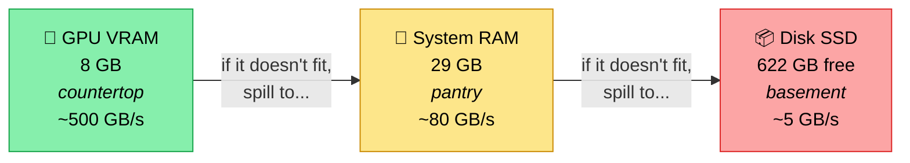
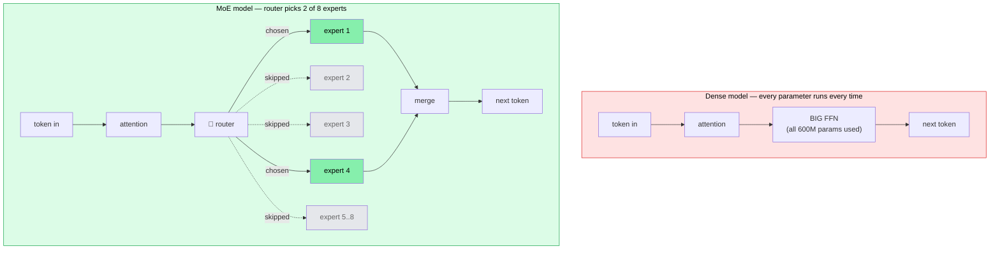
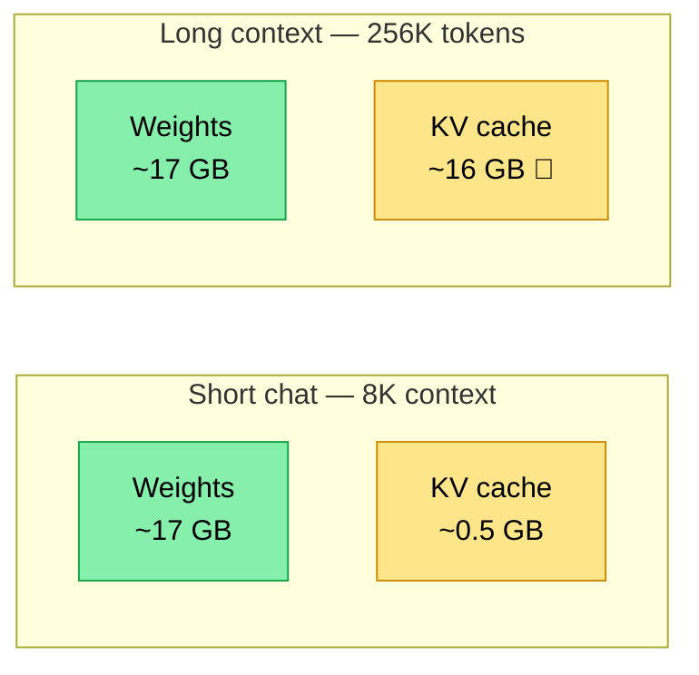
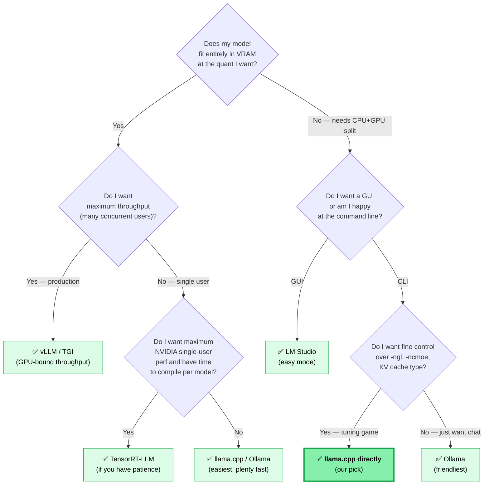
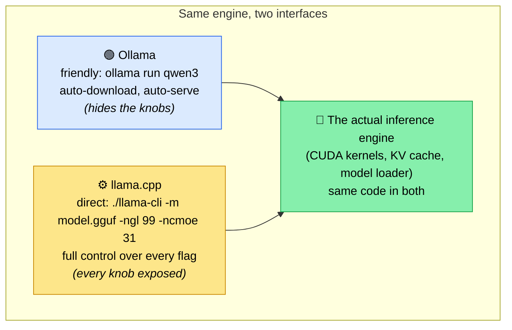
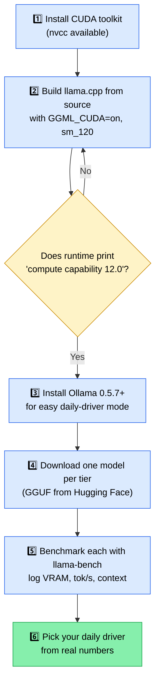

# Running Big LLMs on a Laptop — A Tutorial

A friendly walk-through written in the spirit of the **Feynman technique**: if you can't explain it simply, you don't really understand it. So we build up from scratch, use everyday analogies, and unpack every piece of jargon the first time it shows up.

Audience: you, sitting in front of a freshly-Linux'd laptop, asking *"how big a language model can I actually run on this thing?"*

---

## 0. The whole picture, in one paragraph

A language model is a giant pile of numbers (called **weights**). To make it answer a question, your computer has to load those numbers into fast memory and do math on them. Bigger pile → smarter model, but also → needs more memory and more time. The whole game of running LLMs locally is **fitting the pile into the memory you have, and getting the math done fast enough to be usable**. That's it. Everything below is just learning where the pile lives, where the math happens, and the tricks to squeeze a bigger pile into a smaller space.

---

## 1. Know your laptop — the kitchen analogy

Think of running an LLM like cooking a recipe.



| Part of the laptop | Kitchen analogy | Your laptop has |
|---|---|---|
| **GPU VRAM** | The countertop you cook on. Fast access, limited space. | **8 GB** (NVIDIA RTX 5060 Laptop) |
| **System RAM** | The pantry next to the counter. Bigger, slower to fetch from. | **29 GB** |
| **Disk (SSD)** | The basement freezer. Huge, but slow to walk down to. | **622 GB free** |
| **GPU cores** | Your fastest chef — does math in parallel like an octopus. | RTX 5060 (Blackwell architecture) |
| **CPU cores** | A regular chef — slower, more flexible. | AMD Ryzen AI 9 365, 10 cores |

**The rule of cooking**: ingredients on the **countertop** (VRAM) get used fastest. If they don't fit, you keep some in the **pantry** (RAM) and walk over each time you need them — slower, but it works. If they don't fit there either, you grab from the **basement** (disk) — really slow, but technically possible.

> **Jargon unpack**:
> - **GPU** = Graphics Processing Unit. The "octopus chef" — does the same simple math on thousands of numbers at once. Perfect for LLMs.
> - **VRAM** = Video RAM. The GPU's private, super-fast memory.
> - **RAM** = Random Access Memory. The CPU's main memory — bigger but slower than VRAM.
> - **Blackwell** = the codename for NVIDIA's 2025 GPU generation. Your card uses it. Why we care: brand-new chips need brand-new software (more in §3).

---

## 2. Why "biggest model" is two questions, not one

People ask "what's the biggest LLM I can run?" expecting one answer. There are actually two:

**Question A — "Biggest *fast* model?"**
Translation: *what fits entirely on the countertop?* For your 8 GB VRAM, that's a model around **7–8 billion parameters** (called "7B–8B"). It runs at 50–80 words per second — feels like a chat.

**Question B — "Biggest model that runs *at all*?"**
Translation: *what fits if I use the countertop + pantry + basement together?* For you, that's massive — 30B, 70B, even 200B+ parameter models can technically *load*, but they crawl at 1–5 words per second or worse. Cool demo, painful to use.

**Lesson**: when you say "biggest," decide which one you mean. The right model for daily use ≠ the biggest you can show off.

> **Jargon unpack**:
> - **Parameters** = the numbers in the pile. "7B" means 7 billion numbers. Each number takes some bytes of memory (depends on quantization, see §5).
> - **tok/s** ("tokens per second") = the unit for "how fast does it generate text." A token is roughly ¾ of a word. 50 tok/s feels instant; 5 tok/s feels like you're waiting on a slow human typist; 1 tok/s is "go make coffee."

---

## 3. New chip, new problem — the "fresh kernel" rule

Your RTX 5060 Laptop is brand new. Its chip uses the **Blackwell architecture** (NVIDIA's name for it), which the software world identifies as `sm_120`. Think of `sm_120` as the dialect your GPU speaks.

Here's the trap: most LLM software you'll find on the internet was compiled before `sm_120` existed. So when you run it:
- It doesn't crash — that would be helpful.
- It silently falls back to using the **CPU** instead.
- You get terrible speed and blame the model.

**The rule**: before benchmarking anything, make sure your tools were built **after January 2026** (when sm_120 support landed widely). Specifically:
- **llama.cpp**: build it yourself from source, or grab a release from this year.
- **PyTorch**: use the *nightly* build with CUDA 12.8+, not the "stable" one.
- **Ollama**: version 0.5.7 or newer.

> **Jargon unpack**:
> - **Kernel** (in GPU-speak) = a small program that runs on the GPU. Each model operation has a kernel for each GPU dialect. No `sm_120` kernel = no GPU acceleration.
> - **CUDA** = NVIDIA's framework for talking to its GPUs. CUDA toolkit = the compiler+libraries you need to build GPU code. You don't have it installed yet — `nvcc` is missing. We'll need it to build llama.cpp.
> - **llama.cpp** = the most popular open-source program for running LLMs locally. Started as a hobby project; now industrial-strength. Reads a model file format called **GGUF**.
> - **Ollama** = a friendly wrapper around llama.cpp. Easier to use, less control.

---

## 4. The MoE trick — eating an elephant one bite at a time

Old-school LLMs are **dense**: every parameter is used for every word generated. A 30B dense model means *all 30 billion numbers* get touched to produce each token. Heavy.

**Mixture of Experts (MoE)** is a clever trick. The model is split into many "experts" (think specialists). For each token, a tiny router picks just a few experts to actually run. The rest of the experts sit idle for that token.



So a model labeled "30B / 3B active" has **30 billion total parameters** living in memory but only **3 billion active per token**. Memory cost = 30B (you still have to store everyone). Speed cost = 3B (you only do math on the active 3B).

Why this matters for your laptop:
- The 30B total fits in your 29 GB RAM (just barely).
- The 3B active fits easily on your 8 GB VRAM.
- Result: a "30B-class" model running close to "3B speed."

This is the single biggest reason 2026 LLMs feel different from 2024 ones. Models like **Gemma 4 (26B/4B)** and **Qwen 3 30B-A3B** are designed exactly for hardware like yours.

**Lesson**: when VRAM is tight, **prefer MoE over dense**. You get a bigger model on paper and faster speed in practice.

> **Jargon unpack**:
> - **Dense model** = "everyone works on every problem." Simple, predictable, expensive.
> - **MoE (Mixture of Experts)** = "the right specialist works on each problem." More memory but less compute per token.
> - **Active parameters** = how many parameters are actually used per token. The number that drives speed.

---

## 5. Quantization — shrinking the pile

A model's weights are originally stored as 16-bit numbers (FP16). That means each parameter takes 2 bytes. A 27B model = 27 × 2 = **54 GB** of weights at FP16. Way too big for an 8 GB GPU.

**Quantization** is the trick of storing each weight in fewer bits. The accuracy drops a tiny bit, but the model gets dramatically smaller.

| Quant level | Bits per weight | 27B model size | Quality |
|---|---|---|---|
| FP16 | 16 | 54 GB | Original |
| Q8_0 | 8 | 28.6 GB | Indistinguishable |
| Q6_K | 6 | 22.5 GB | Excellent |
| **Q5_K_M** | ~5.5 | 19.5 GB | Very good |
| **Q4_K_M** | ~4.5 | 16.8 GB | The sweet spot most people use |
| Q3_K_M | ~3.5 | 13.3 GB | Visible drop, still useful |
| Q2_K | ~2.5 | 10.7 GB | Last resort, reasoning suffers |

**Rule of thumb**: at Q4_K_M, model size in GB ≈ **0.6 × parameter count in billions**. So a 14B model is ~9 GB, a 32B model is ~19 GB.

**Lesson**: pick the highest quant level that still fits your memory budget with room for the KV cache (next section) and a little buffer. Q4_K_M is the universal default.

> **Jargon unpack**:
> - **Q4_K_M** etc. = different recipes for compressing weights. The "K" and "M" are technical variants — you don't need to care, just know K_M is a good balance.
> - **GGUF** = the file format llama.cpp uses. Quantized models are distributed as `.gguf` files on Hugging Face.

---

## 6. The KV cache — the model's short-term memory

Every time the model generates a token, it has to remember the previous tokens. It does this by storing two vectors per token per layer, called **K** and **V** (Keys and Values). All those stored vectors together = the **KV cache**.

The KV cache lives in memory alongside the weights. And it grows as the conversation gets longer.

For a typical 27B dense model at 32K context (about a 25,000-word conversation), the KV cache is around 1–2 GB. At 256K context, it can balloon to **16 GB** — bigger than the weights themselves at low quant.



The KV cache size scales linearly with how much conversation history the model is "seeing." Short chats are nothing; long-document analysis is where memory blows up.

**Lesson**: when planning memory, don't just count weight size. Count weights + KV cache + a buffer. At long contexts, KV cache becomes the biggest item.

---

## 7. TurboQuant — squeezing the KV cache

In March 2026, Google DeepMind published **TurboQuant** (Zandieh et al., ICLR 2026). It compresses the KV cache from 16 bits per element down to 2–4 bits, with almost no quality loss.

- turbo4 (4.25-bit) → ~3.8× compression, +1% PPL — basically lossless
- turbo3 (3.125-bit) → ~5.1× compression, matches q8_0 quality at ctx=2048
- turbo2 (2.125-bit) → ~7.5× compression, +5% PPL — long-context champion
- turbo1.5 (2-bit) → ~8× compression, +8% PPL — extreme

Usage in llama.cpp (after building from a fork that supports it):
```
--cache-type-k turbo3 --cache-type-v turbo3
```

**When TurboQuant helps you a lot**: long-context use. Qwen 3 8B at 32K tokens won't even *load* on this 8 GB GPU at FP16 KV (4.6 GB cache + 4.7 GB weights = 9.3 GB). With turbo3 the cache shrinks to ~1 GB — the model loads and runs at **24 tok/s**.

**When TurboQuant doesn't help much**: short 8K–32K chats where you already fit. KV cache is 0.5–2 GB at that range — saving 1 GB doesn't unlock the *weights*, which are the bottleneck.

**Counterintuitive measurement**: at long context, **turbo2 is *faster* than turbo3**. Smaller cache → less memory bandwidth per token → faster decode. On our laptop at 32K depth: turbo3 = 24.4 tok/s, **turbo2 = 28.5 tok/s**. Compression buys you *more* speed at long context, not less.

**Lesson**: TurboQuant compresses the KV cache, **not the weights**. Reach for it to fit a long *context*, not to fit a *model* that's too big.

**Hardware caveat for Blackwell sm_120**: not every TurboQuant fork works on RTX 5060/5090. The fork that does is [`Madreag/turbo3-cuda`](https://github.com/Madreag/turbo3-cuda) — explicitly validated on sm_120 with a graceful fallback for the NVIDIA compiler bug at head_dim=256. We tried `AmesianX/TurboQuant` first; it compiled but hung indefinitely on Blackwell. See `BENCHMARKS.md` § "TurboQuant KV cache compression — long-context demo" for the full numbers and fork comparison.

---

## 8. Hybrid attention — why some 27Bs are easier than others

The "regular" attention mechanism in transformers grows the KV cache linearly with context. The longer the conversation, the bigger the cache.

Some 2026 models use **hybrid attention**: most layers use a different mechanism called **linear attention** (or "Gated DeltaNet" in Qwen3.6's case), which has a *fixed-size* state regardless of context length. Only a few layers use traditional softmax attention.

Qwen3.6-27B for example: 64 layers total, but only 16 of them use softmax attention. The other 48 use linear attention with no per-token KV growth. Result: at 256K context, its KV cache is ~16 GB — about a quarter of what a pure-softmax 27B would need.

**Lesson**: when comparing two same-sized models, check the architecture. Hybrid/linear attention models punch above their weight on long-context memory budgets.

---

## 8.5 Choosing an inference tool — the landscape in 2026

Before picking a model, you have to pick the *thing that runs the model*. This is the inference engine. It's the program that loads the weights, does the math, and gives you back text.

The tools landscape is crowded. Most blog posts only mention one or two. Here's the full picture, ordered by how well each one fits a laptop with limited VRAM (our scenario).

### The contenders

| Tool | What it is | Strengths | Weaknesses |
|---|---|---|---|
| **llama.cpp** | C++/CUDA library + CLI. The de facto open-source standard. | Runs everywhere (CPU, NVIDIA, AMD, Apple, Intel), GGUF format is well-supported, fine-grained control (`-ngl`, `-ncmoe`, `-ctk`), tiny binaries, builds from source easily. | More flags to learn. No GUI. |
| **Ollama** | Friendly wrapper that bundles llama.cpp + a model registry. | One-command install, `ollama pull qwen3` just works, OpenAI-compatible API server, runs in background as a service. | Hides the flags — can't tune `-ncmoe`. Model registry lags behind HF for cutting-edge releases. |
| **LM Studio** | Desktop GUI app, also wraps llama.cpp internally. | Click-to-run, built-in chat UI, lets you browse HF GGUFs. | macOS/Windows-first; CPU/GPU split is less tunable. |
| **vLLM** | Production serving framework, GPU-only, optimized for batched concurrent users. | Highest *throughput* when fully on GPU, supports continuous batching, paged KV cache. | **Must fit entirely in VRAM.** No CPU offload. Useless for our 8 GB ↔ 30B scenario. |
| **TGI** (Text Generation Inference) | HuggingFace's prod server, similar to vLLM. | Tight HF integration, robust serving features. | Same VRAM-bound limitation as vLLM. |
| **TensorRT-LLM** | NVIDIA's hyper-optimized engine. | Fastest possible NVIDIA-only inference. | Per-model recompilation, brutal install, GPU-only, not friendly for experimentation. |
| **MLC LLM** | TVM-based, cross-platform compile-to-target. | Strong on mobile + WebGPU, AOT compiled. | Smaller GGUF/community, learning curve, less recent-model support. |
| **ExLlamaV2/V3** | GPU-only, optimized for NVIDIA, EXL2/EXL3 weight format. | Very fast on a single big GPU, great with high-quant models on 24+ GB cards. | GPU-only — eliminates CPU offload. |
| **SGLang** | Newer batched-serving framework with structured output. | Excellent for agent/JSON workloads, fast prompt processing. | Server-side; not for interactive laptop chat. |
| **KTransformers** | Specialized for offloading huge MoE models on consumer hw. | Pushes the absolute biggest MoE models on tiny VRAM. | Niche, smaller community, less broad model support. |
| **HF Transformers + accelerate** | The reference research library. | Universal model support, easy to script in Python. | **Slow** for inference — built for training/research, not optimized serving. |

### The decision tree for *this laptop*



### Why we picked llama.cpp

For our specific scenario — **8 GB VRAM, want to push past it, want to learn how it actually works** — llama.cpp wins on every constraint:

1. **CPU+GPU split is a first-class feature.** `-ngl` and `-ncmoe` are exactly the knobs we need to fit a 30B MoE model that doesn't fit in VRAM. vLLM, TGI, ExLlama, and TensorRT-LLM can't do this — they're VRAM-bound.

2. **MoE-aware expert offload (`-ncmoe`).** The "30B at 8 GB VRAM" trick from §4 only works because llama.cpp lets us keep attention on GPU and push experts to CPU. Most other tools don't expose this.

3. **Brand-new GPU support (Blackwell sm_120).** llama.cpp builds from source in 10 minutes with `CMAKE_CUDA_ARCHITECTURES=120`. Pre-built tools often lag months behind on new architectures and silently fall back to CPU.

4. **GGUF format is universal.** Every recent open-weight model is on Hugging Face as a GGUF, often days after release. llama.cpp reads them natively. Ollama's registry is convenient but lags.

5. **KV cache quantization is available.** `-ctk q4_0 -ctv q4_0` already gives 4× compression in stock llama.cpp. Experimental forks (TurboQuant) push further. None of the other tools have this knob exposed.

6. **It's the substrate.** Ollama, LM Studio, and many "local LLM" apps are wrappers around llama.cpp. By using llama.cpp directly, we're using the same engine — minus the wrapper that hides the flags we want to tune.

### Where the other tools shine

This isn't a "llama.cpp wins everything" claim. It's the right pick *for our constraints*. Other tools win in other contexts:

- **Production API at scale on a real GPU**: vLLM or TGI, hands down. Better throughput, better batching, mature serving.
- **Set up once, never tune**: Ollama. Auto-pull, auto-serve, OpenAI-compatible.
- **Just want a chat window, not a terminal**: LM Studio. Click, chat, done.
- **Have a 24+ GB GPU and want absolute max single-user speed**: ExLlamaV2 with EXL3 weights.
- **Need maximum NVIDIA performance, willing to compile**: TensorRT-LLM.
- **Want to push a 200B+ MoE model on a laptop**: KTransformers (more aggressive offload than llama.cpp).

### llama.cpp vs Ollama — the most common confusion

These are not competing tools. **Ollama runs llama.cpp under the hood.** The distinction is the layer above:



**Use both.** Ollama for "I want to try a model right now," llama.cpp directly for "I want to know exactly why this is slow and how to make it faster." On this laptop, they coexist with no conflict — Ollama on port 11434, llama.cpp's own `llama-server` on 8080.

---

## 9. The model ladder for *this specific laptop* (April 2026)

Putting it all together, here's what each tier looks like on your machine. *Italics* = measured, plain text = projected.

| Tier | Model | Why it works | Expected speed |
|---|---|---|---|
| Daily fast | **Qwen 3 8B** (Q4) | ~5 GB, fits VRAM entirely | *measured: pp 2263 t/s, tg 63.7 t/s* |
| Smartest dense | **Phi-4-reasoning 14B** (Q4) | ~9 GB, slight RAM offload | 25–40 tok/s |
| **MoE sweet spot** | **Gemma 4 (26B/4B)** Q4 | 16 GB total in RAM, 4B hot path on GPU | 20–30 tok/s |
| MoE flex | **Qwen 3 30B-A3B** (Q4) | ~18 GB total, 3B active | 15–25 tok/s |
| Dense stretch | **Qwen 3 32B** (Q3) | ~14–16 GB, partial offload | 3–5 tok/s |
| Dense trophy | **Qwen3.6-27B** (Q3_K_M) + TurboQuant | 13 GB weights + long-context KV compressed | 2–4 tok/s |
| Trophy run | **DeepSeek V4 Flash** 284B/13B (Q2) | mmap from disk — yes, the basement | <1 tok/s |

Out of reach: DeepSeek V4 Pro (1.6T total), Kimi K2.6 full, GLM-5 — workstation tier.

---

## 10. How to pick — match the question to the answer

Don't pick a model by "biggest number." Pick by what you actually want to do.

| If you want… | Pick |
|---|---|
| Snappy daily chat | Qwen 3 8B |
| Best reasoning at usable speed | Phi-4-reasoning 14B |
| The biggest model that *also* feels usable | Gemma 4 (26B/4B) or Qwen 3 30B-A3B |
| The biggest dense model with okay speed | Qwen 3 32B (Q3) |
| The biggest dense + long context | Qwen3.6-27B + TurboQuant |
| To brag that you loaded a 284B model on a laptop | DeepSeek V4 Flash Q2 (mmap) |

These are five different right answers. Don't conflate them.

---

## 11. What's next — your first session plan

A concrete plan when you're ready to actually run something:



That's a separate session — start when you're ready.

---

## Appendix — the Feynman test

A check: if a friend who has never run an LLM asked you "why does my 8 GB GPU let me run a 30B model but not a 14B model?", could you answer using just sections 4 and 5? If yes, this tutorial worked. If not, the gap is the part to re-read. (The answer: a 30B *MoE* with 3B active is mostly RAM-resident with a small GPU hot path; a 14B *dense* model wants 9 GB on the GPU — slightly more than your 8 GB — so it actually has the *worse* fit despite being smaller on paper.)
