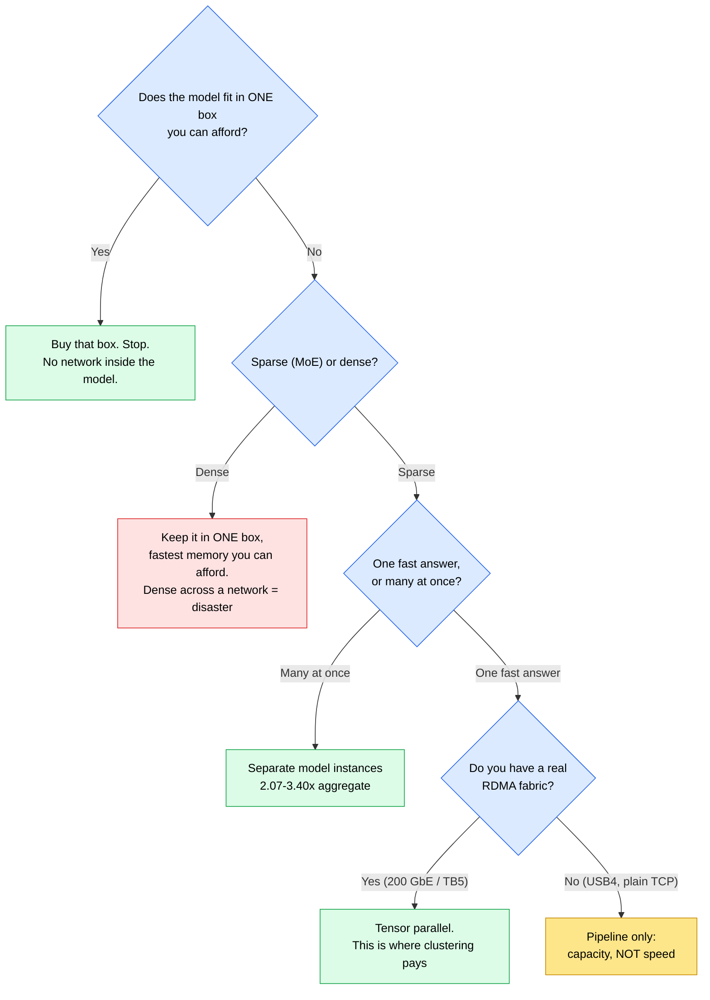

# Choosing a Local LLM Cluster — a buyer's guide

> You are about to spend real money on hardware to run a large model at home, and the internet is full of people telling you what to buy. This is the guide I wanted before I started reading. **Recommendations first, reasoning after** — so you can act on it in two minutes or study it for an hour.

**Prices and product lineups are a July 2026 snapshot and will age fast. The ranking and the reasoning outlive the numbers — re-check the numbers before you pay.**

**Disclosure up front:** I own none of the cluster hardware in this guide. Every foreign measurement is attributed to whoever made it. The only first-party numbers here are my own laptop (RTX 5060, 8 GB VRAM, 29 GB DDR5) and the arithmetic, which you can redo yourself.

---

## 1. Just tell me what to buy

| Your situation | Buy this | Why |
|---|---|---|
| **You own one GPU already** | **A second card in the same box** — not a second machine | 48 GB, tensor parallelism actually works at motherboard distance, no risers, ~1000 W PSU. Best value move in this entire guide. |
| **You want one calm purchase, big models, chat-shaped work** | **Mac Studio M3 Ultra** | 819 GB/s — ~3× any other whole-machine option — and up to 512 GB unified. Quiet, one box, no assembly. |
| **You genuinely intend to cluster** | **2× DGX Spark**, joined by the ConnectX-7 200 GbE link | The only consumer-priced fabric with a *measured* payoff: ~75 → up to 120 tok/s on gpt-oss-120B going from one node to two. Plus the CUDA ecosystem. |
| **You want a huge model cheaply and quietly** | **4× Mac mini M4 Pro** | 192 GB pooled for ~$7,000, and ~200 W for the *whole cluster* — less than a single RTX 5090. Slow, but it runs 671B models at all. |
| **You are serving several people at once** | **Multiple GPUs, running separate model instances** — not one model split | 2.07–3.40× more aggregate throughput than tensor-parallel on the same 4 cards. Most underused result in local AI. |
| **One machine, forever, on a budget** | **The cheapest Strix Halo box** (~$3,650) | Competitive single-box decode, 128 GB, OS freedom. Only at the *bottom* of its price range — see below. |
| **You already own several machines** | **Cluster what you have, first** | Costs nothing to find out. |
| **Light or occasional use** | **Rent** | A 3090 is ~$0.22/GPU-hr. Two hours a day ≈ $13/month. Buying takes years to catch up. |

### And what *not* to buy

| Avoid | Why |
|---|---|
| **A third GPU** | Tensor parallelism splits attention heads across cards; head counts are almost always divisible by 2/4/8 and **almost never by 3**, so the engine refuses to launch rather than running slowly. |
| **RTX 5090, for inference** | $3,500–4,600 street, 575 W, and NVLink was **removed**. Two used 3090s cost less, hold 48 GB vs 32, and can still split a model between them. Superb card, wrong job. |
| **Old datacentre cards** (Tesla P40 / P100 / V100) | Below the compute-capability 7.5 floor modern serving stacks require. vLLM simply won't run. 24 GB at 19 % of a 3090's prefill is not a bargain. |
| **A second CPU socket, for MoE generation** | Measured at 102–108 % scaling on big sparse models — one rig was *negative*. (It does help dense models: 182–190 %.) |
| **Strix Halo as node 1 of a cluster** | Good single machine. Its USB4 measured 9–11.4 Gbps, worst in class, and its "RDMA" is a software shim at ~65 µs. |
| **Any machine bought for a port speed nobody has published a measurement for** | Ports are sold on the label, not the measurement. See §6. |

---

## 2. The thing almost everyone gets wrong

A common and reasonable mental model goes: *"NVLink NVIDIA is best because of CUDA; otherwise Macs are fine; AMD is OK for a single device but not for clustering."*

**Two thirds of that is right. The NVLink part is not**, and it's worth fixing because it changes what you shop for.

**NVIDIA does win — but not via NVLink.**

- On **new consumer cards NVLink is gone.** The RTX 5090 removed it entirely. The only consumer NVLink left is the *used* 3090's pair bridge (~112 GB/s), and its benefit is measured at **+48 % on two cards, falling to about +9 % at four**. It's a two-card, used-market phenomenon — not a thing you can buy new.
- **Two DGX Sparks do not talk over NVLink.** They talk over an onboard **ConnectX-7 200 GbE NIC running RoCE (RDMA)** with NCCL — one QSFP56 direct-attach cable, no switch. NVLink-C2C *does* exist on Spark, but it's the **internal CPU↔GPU link on the GB10 chip**, not the node-to-node fabric.

So the durable NVIDIA advantages are: **the CUDA ecosystem** (this part of the model is exactly right — vLLM, training, fine-tuning and most serving tools assume it), **a real 200 Gb RDMA fabric with published 2-node scaling**, and **prefill** (1,723 vs 340 tok/s against Strix Halo).

**Macs are better than "fine."** Mac Studio M3 Ultra reads memory at 819 GB/s — roughly **3× either 128 GB box** — which is the single number that governs how fast words come out. Macs also genuinely cluster: 4 nodes over Thunderbolt 5 + RDMA reached 31.9 tok/s on Qwen3-235B and 32.5 on DeepSeek V3.1 671B. The honest weaknesses are **prefill** (~8× behind a strong GPU) and **no CUDA**.

**The AMD call is exactly right.** Good single machine, no fast way to become two. That's the cleanest verdict in this guide.



---

## 3. The three numbers that decide everything

Every honest decision here reduces to three quantities:

| Number | What it decides | Where it bites |
|---|---|---|
| **Capacity** (total fast memory) | Whether it runs *at all* | Model doesn't fit → nothing else matters |
| **Bandwidth** (how fast that memory is read) | How *fast* it answers | This is the one people misread |
| **Latency** (gap between machines) | Whether *splitting* can ever be fast | Kills naive clusters |

The division worth memorising:

```
tokens/sec  ≈  memory bandwidth  /  bytes read per token
```

A 900 GB/s card that must read 13.5 GB per token tops out near 66 tok/s. You will land under that ceiling, never over it. It's bookkeeping rather than physics, but it's close enough to **reject a bad purchase before you make it**.

This is also why the fastest chip isn't automatically the right buy: **reading the weights is the slow part, not the multiplying.** A processor that multiplies twice as fast, attached to the same memory, mostly waits twice as politely.

---

## 4. Sparse or dense — the property that flips the answer

Models come in two shapes, and they look identical on a download page:

- **Dense** — every weight is used for every token.
- **Sparse (MoE)** — the same weights on disk, but only a small fraction wakes up per token.

Measured on my own laptop (RTX 5060, 8 GB VRAM + 29 GB DDR5) — **first-party, the only such numbers here:**

| Model | Bytes read per token | Measured tok/s |
|---|---|---|
| Qwen3 30B-A3B (**sparse**) | 1.68 GB | **53.8** |
| Qwen3.6 27B (**dense**) | 13.57 GB | **7.8** |

Same machine, same VRAM, ~7× the speed — from a property of the *model*, not anything I bought.

**What it means for your shopping list:**

- **Sparse → a cluster can work.** Each node moves little data per token, so the network has a chance to keep up.
- **Dense → keep it in one box** with the fastest memory you can afford. A 405B dense model across a 4-node cluster was measured at **0.7 tok/s**.

---

## 5. The two ways to split a model

**Pipeline (layer split)** — cut the model into slabs, one per machine. Machine 1 does the first quarter, hands off, and so on.

> **This buys capacity, not speed.** A token still walks through every machine in turn, so time per token is the *sum*, not the average. Measured on GPUs: 2× 3090 gave 16.57 tok/s on Llama 3 70B; 4× 3090 gave **17.09**. Double the hardware, buy essentially nothing.

**Tensor parallel** — every machine holds a thin slice of every layer and they all work the same token simultaneously. This genuinely divides the work, and charges you in **latency**:

```
94 layers × 2 collectives  =  188 round trips per token

188 × 300 µs (ordinary networking)  =  56.4 ms/token
188 ×  50 µs (fast RDMA link)       =   9.4 ms/token
```

Nothing changed but the wire. This is why tensor parallelism shines *inside one box* (microsecond distances — measured +47 % on Qwen2.5-72B, +90 % on Mistral-Large-123B across 4× 3090) and struggles across a room unless you bought an unusual network.

**Split modes, July 2026:**

| Mode | What it does | Verdict |
|---|---|---|
| `layer` | pipeline, the default | safe, capacity, no speedup |
| `row` | splits dense weights only | **DEPRECATED — avoid** |
| `tensor` | splits weights + KV cache | the 2026 answer, still experimental |
| `none` | one device holds everything | fastest, if it fits |

---

## 6. The wire — check latency, not the number on the box

**Bandwidth is what the cable is sold on. Latency is what those 188 round trips per token actually pay for.** A wider cable with the same delay buys you almost nothing here.

| Link | Claim | What was actually measured |
|---|---|---|
| Thunderbolt 5 | 80 Gbps both ways | no published Mac-to-Mac TCP figure |
| TB5 + RDMA | — | 28–42 Gbps (37–52 % of the port) |
| TB5 "120 Gbps" | a boost mode | display only, never networking |
| **USB4 on Strix Halo** | 40 Gbps port | **9–11.4 Gbps — worst in class** |
| USB4 on a tuned NUC13 | 40 Gbps port | 26–27 Gbps |
| soft-RoCE on Strix Halo | "RDMA" | ~9 Gb/s at 65 µs — an API shim |

*Source: published third-party measurements, July 2026.*

**The check to run before buying anything for its ports:**

1. Don't ask what the port is *rated* at — ask whether anyone published a **measurement on that exact machine**.
2. Ask for **microseconds per message**, not just throughput.
3. Treat "supports RDMA" with suspicion until you see the latency. One row above calls itself the fast protocol and delivers 65 µs.
4. No published number → assume the worst.

---

## 7. The options, priced (July 2026)

### Whole machines

| Machine | Launch | Today | Bandwidth | Notes |
|---|---|---|---|---|
| Framework Desktop 128 GB | $1,999 | $3,449 | ~256 GB/s | +73 % |
| Beelink GTR9 Pro | $1,985 | $4,349 | ~256 GB/s | +119 % |
| GMKtec EVO-X2 | — | $3,650 | ~256 GB/s | cheapest Strix Halo |
| **DGX Spark** | $3,999 | $4,699 | 273 GB/s | ConnectX-7 200 GbE |
| **Mac Studio M3 Ultra** | $3,999 | $5,299 | **819 GB/s** | entry config; big-memory ≈ 2× |

Every one is well above launch price — if you're reading a review quoting launch prices, it's out of date.

### Spark vs Strix Halo — nearly tied alone, not close together

| | DGX Spark | Strix Halo box |
|---|---|---|
| Memory bandwidth | 273 GB/s | 256 GB/s |
| Decode, gpt-oss-120B | ~39 tok/s | ~34 tok/s |
| **Prompt processing** | **1,723 tok/s** | **340 tok/s** (5× behind) |
| Cluster link | ConnectX-7 200 GbE, RoCE | USB4, 9–11.4 Gbps measured |
| RDMA | real (NCCL over RoCE) | soft shim, ~65 µs |
| Price | $4,699 | $3,650–4,349 |

Alone, within ~7 % on bandwidth — price should decide. **Connected, ~20× the link.**

### Clustering, measured

| Setup | Model | Result |
|---|---|---|
| 1× DGX Spark | gpt-oss-120B, full precision | ~75 tok/s |
| **2× DGX Spark**, ConnectX-7 | same | **up to 120 tok/s (~1.6× from one added machine)** |
| 4× Mac Studio, TB5 + exo | Qwen3-235B | 31.9 tok/s (**1.56× from three added machines**) |
| 4× Mac Studio, TB5 + exo | DeepSeek V3.1 671B | 32.5 tok/s |
| 4× Mac mini M4 Pro | DeepSeek V3 671B | 5.37 tok/s |
| 4× Mac Studio, llama.cpp/TCP | Qwen3-235B | **15.2 tok/s — slower than ONE node (20.4)** |
| 2× DGX Spark, 1-bit GLM-5.2 | 256K context | 8 tok/s, prefill unfeasible |

That last-but-one row is the whole warning: **four machines on the default tool produced less than one machine.** Same hardware as the 31.9 row — only the stack and the transport changed.

**Ceiling:** two Sparks share 256 GB. Comfortable for ~120B at full precision; past that you're into 1-bit territory where prefill collapses. **The memory is the limit, not the wire.**

### The cheap way in — 4× Mac mini

| | |
|---|---|
| 4× Mac mini M4 Pro, 48 GB each | 192 GB pooled, $6,400–7,200 |
| Whole cluster, full load | **~200 W** — less than one RTX 5090 |
| Qwen2.5-Coder 32B | 18 tok/s |
| DeepSeek V3 671B | 5.37 tok/s |

It only works because Thunderbolt 5 gained kernel-level RDMA (~99 % latency cut). Before that, Mac clustering *was* the 15.2 tok/s embarrassment above.

### GPUs in one box

| Cards | VRAM | GPU cost | What it demands |
|---|---|---|---|
| 1 | 24 GB | $850–1,300 | any desktop, 750–850 W |
| **2 ← sweet spot** | 48 GB | $1,700–2,600 | AM5 + 1000 W, TP works, no risers |
| 3 | 72 GB | — | **avoid — TP heads rarely divide by 3** |
| 4 | 96 GB | $3,400–5,200 | 20 A or power-limiting, Threadripper, risers, open frame |
| 8 | 192 GB | ~$8,000 | dedicated 20 A, daisy-chained PSUs |

**Used 24 GB card price history:** $500–700 (Dec 2025) → $1,300–1,500 peak (June 2026) → $850–1,050 private / $1,000–1,300 auction (July 2026). Nine published "best GPU for AI" guides quoted the same card in the same month anywhere from $600 to $1,050 — **check several sources on the day you buy.**

### Threadripper + 4× 3090, honestly

You reach for Threadripper for **PCIe lanes**, not speed — an ordinary desktop board runs out after ~2 cards. Target x16 per card; an x8 slot halves bandwidth and throttles noticeably. Verify with `nvidia-smi topo -m`.

| Item | Figure |
|---|---|
| 4 cards, GPU cost only | ~$4,232 |
| **AIB card, sustained** | **380–420 W** (not the 350 W reference figure) |
| AIB card, peak | up to 464 W — budget 400 W each |
| 4-card system total | 1,850–2,100 W |
| PSU | **2,000 W 80+ Platinum** (3 cards: 1,600 W Gold) |
| …power-limited to 220 W | **~880 W** of GPU, down from ~1,600 W |

**Power-limiting is nearly free:** 350 W → 300 W measured *faster* (33.0 vs 32.0 tok/s); 250 W cost ~1 %; only at 200 W does it collapse (−36 %). This is what makes a 4-card build possible in an ordinary house.

---

## 8. The traps

**Buying a used card:**
- Ask whether it was mined on, and for how long.
- Ask for a photo under load with temperatures visible.
- Budget for new thermal pads — the memory runs hot and pads age.
- **`nvidia-smi` does not show memory-junction temperature** — the one that kills these cards. Read it with a separate tool.

**Physical, and never in any benchmark:** four cards at full draw trips a normal household circuit; cards are 3 slots wide so board *spacing* matters as much as specs; a 4-card build stops fitting in a case and becomes an open frame on a shelf.

**Three software landmines:**

| Trap | What happens | Fix |
|---|---|---|
| `--fit` defaults to on | server 1 eats the pool minus ~1 GiB | always pass `-c`, `-ngl` **and** `--fit off` |
| free-memory probe broken on Strix Halo | reads system RAM, not the amdgpu GTT pool | open issue — place by hand |
| Ollama can't pin a model to a GPU | not a setting you're missing | one server per GPU + `CUDA_VISIBLE_DEVICES` + a proxy |

**And the idea worth more than most of the hardware:** with two devices, run *two whole models* rather than splitting one. Same 4 cards, power-matched at 220 W:

| Model | one instance, TP=4 | four instances, TP=1 | ratio |
|---|---|---|---|
| gemma-4-12B AWQ | 1,007 | 3,425 | **3.40×** |
| Qwen3.6-27B INT8 | 358 | 741 | 2.07× |

(Caveat: N copies of the *same* model — helps throughput, not single-reply latency.)

---

## 9. Check your own shopping list before you pay

`cluster_roofline.py` in this folder does the arithmetic above. Pure stdlib, no dependencies:

```bash
# the walkthrough, on the machine I actually own
python3 cluster_roofline.py --demo
```

Now price the 4-node cluster from §7 — a 235B MoE with ~10 % active per token, 819 GB/s nodes, 94 layers — **once on ordinary networking, once on a fast RDMA link.** Only the last number changes:

```bash
# ordinary networking, ~300 µs per round trip
python3 cluster_roofline.py --model-gb 235 --active-frac 0.10 --bandwidth 819 \
    --mode tensor --nodes 4 --layers 94 --link-latency-us 300
```
```
  network time / token : 56.40 ms   (188 round trip(s))
  PREDICTED CEILING    : 15.73 tok/s
  vs ONE machine       : 34.85 tok/s  ->  0.45x  SLOWER THAN 1 NODE
```

```bash
# same cluster, real RDMA at ~50 µs
python3 cluster_roofline.py --model-gb 235 --active-frac 0.10 --bandwidth 819 \
    --mode tensor --nodes 4 --layers 94 --link-latency-us 50
```
```
  network time / token :  9.40 ms   (188 round trip(s))
  PREDICTED CEILING    : 60.34 tok/s
  vs ONE machine       : 34.85 tok/s  ->  1.73x  SPEEDUP
```

**Compare that to reality.** On that same 4-node Mac cluster, llama.cpp over plain TCP measured **15.2 tok/s** — against 15.73 predicted — and the RDMA/tensor stack measured **31.9**. The tool lands in the right region on hardware I have never touched, and it correctly predicts the thing that surprises people: **four machines on a slow wire are slower than one machine.**

**Read the output as a ceiling, not a promise.**

- Within ~20 % of published results → healthy plan.
- Off by 10× → **stop**. No amount of tuning recovers an order of magnitude, and you just saved the price of the hardware by typing one command.

---

## 10. What it costs to run — and when to rent

A 4-card machine pulling ~1.2 kW around the clock:

| Country | Rate/kWh | Monthly |
|---|---|---|
| Türkiye | $0.100 | **$88** |
| USA avg | $0.184 | $162 |
| EU avg | $0.329 | $289 |
| Germany | $0.440 | **$386** |

Over three years that spread exceeds the machine. **Your electricity rate can flip the verdict**, and most advice online is written where power is expensive.

**Cloud reference (per GPU-hour, July 2026):** RTX 3090 $0.22 (Vast $0.13) · 4090 $0.34 · 5090 $0.69 · A6000 $0.33 · A100 80 GB $1.19 · H100 $1.99.

> **The rule I'd give almost everyone: rent first.** Use a rented machine for a month doing the work you actually intend to do — not the work you imagine. Then read the bill. When monthly rental starts to look like a payment on the hardware, buy it, knowing your real utilisation instead of guessing.

Owning wins on: data that can't leave the building · always-on availability · heavy daily use · learning the stack. It usually does **not** win on saving money at light use.

---

## 11. What I could not verify

- I own none of the cluster hardware. Every clustered number here is someone else's measurement, reported as theirs.
- Current prices for the A6000, A100 and P40 could not be confirmed.
- DGX Spark's memory bandwidth is a manufacturer spec figure; I found no independent measurement of it.
- Sources disagree on whether PCIe x8 meaningfully throttles 4-GPU inference — one report says power and cooling bind first, another that x8 "throttles noticeably." Both are cited; I have not resolved it.
- Prices move fast enough that some numbers here will be wrong by the time you read this. **The method survives that. The prices won't.**

---

## See also

- **[LESSONS_LEARNED.md](LESSONS_LEARNED.md)** — the theory this builds on (VRAM, MoE, quantization, KV cache)
- **[BENCHMARKS.md](BENCHMARKS.md)** — measured tok/s on the single-laptop setup
- **[HOW_TO_RUN.md](HOW_TO_RUN.md)** — commands and flags, including the split-mode flags above
