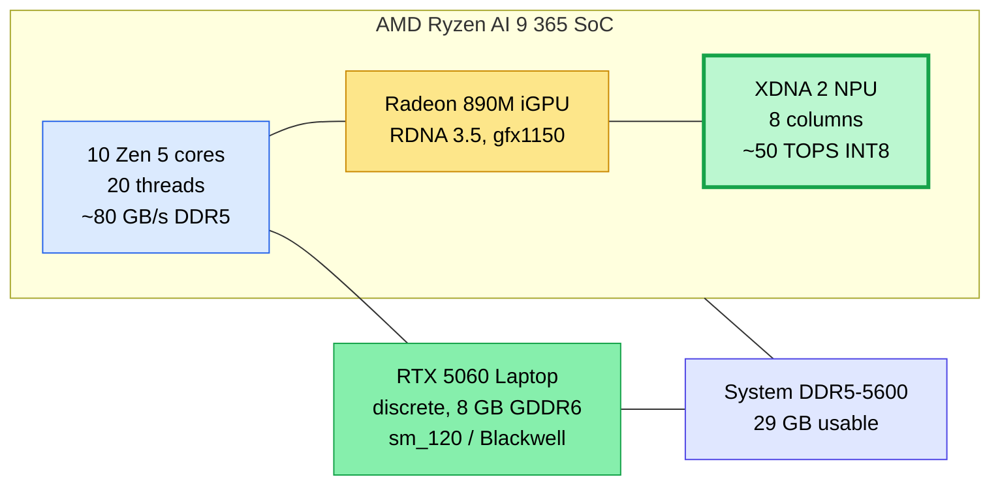

# The XDNA 2 NPU — small-and-cheap inference alongside CUDA

> Companion to [LESSONS_LEARNED.md §5.5](LESSONS_LEARNED.md) and [HARDWARE_BEYOND_CUDA.md](HARDWARE_BEYOND_CUDA.md). Those docs said the AMD XDNA 2 NPU was real silicon with a real Linux software path but **not yet installed** on this laptop. This file documents the install we did, the benchmarks we ran on the NPU, and the practical use cases where it earns its keep.

The NPU on a Ryzen AI 9 365 is **not a competitor to the RTX 5060**. It's a *third accelerator* that runs small models at a tiny fraction of the dGPU's power budget, and crucially, runs them while the dGPU is busy doing something else. Think of it as cheap parallel inference for embeddings, voice transcription, tiny helper LLMs — the kind of "lots of small calls" workload where the dGPU would be overkill.

---

## 1. The 30-second TL;DR

| Model | Decode (tok/s) on NPU | Package power | Compare on CUDA 5060 |
|---|---:|---:|---|
| **qwen3:0.6b** | **92.6** | ~20 W (≈ +10 W over idle) | not benchmarked, but small |
| llama3.2:1b | 62.6 | ~20 W | not benchmarked |
| qwen3:8b | 10.9 | ~20.5 W | **63.7** (5060) — see BENCHMARKS.md |
| embed-gemma:300m | 5.3 embeds/sec (768-dim, short sentences) | ~20 W | n/a (no GGUF embedder benched on CUDA here) |

**The headline numbers**:
1. 92.6 tok/s on a 0.6 B model is genuinely chat-fast. Faster-than-typing-speed at single-digit watts.
2. The NPU draws roughly the same package power *regardless of model size* (~10 W incremental over idle). The smaller the model, the better the tokens-per-joule ratio.
3. While the NPU was driving an 8 B model at 11 tok/s, `nvidia-smi` showed the RTX 5060 sitting at **0 % utilization, 15 MiB, 8.55 W**. **Truly idle.** The NPU and dGPU are independent silicon — running one does not steal cycles or memory from the other.

That third bullet is the use case: pair the NPU with the dGPU for *concurrent* workloads. The dGPU handles your main 30 B chat model; the NPU handles voice/Whisper, embeddings for RAG, a small auxiliary model that filters or routes — all at once, without VRAM or compute contention.

---

## 2. Where the NPU sits on this laptop



The NPU is a **fixed-function block** on the same die as the CPU cores and the iGPU. It speaks a different ISA from both — its native language is INT8 matrix multiplications and a handful of related ops. It does **not** run CUDA kernels, GGUFs, ROCm code, or general-purpose code. It runs models that have been *pre-compiled for it* (more on that below).

What's on the silicon already, before any install:

| Component | Status |
|---|---|
| `amdxdna` kernel driver | ✅ shipped in Linux 7.0; loaded automatically |
| NPU firmware (`amdnpu/17f0_10/npu_7.sbin`) | ✅ loaded at boot |
| Device node `/dev/accel/accel0` | ✅ present, `root:render` perms |
| User ACL on the device | ✅ `ubuntu` already had `rw-` via udev ACL |
| Userspace runtime | ❌ until we installed it (this doc) |

The kernel side is already done by the distro on a recent Linux. Everything below is userspace.

---

## 3. The install we actually ran

Three pieces of software are needed to get from "kernel driver is loaded" to "I can call an LLM and get tokens back":

| Layer | Package | Why it's needed |
|---|---|---|
| **XRT userspace** | `libxrt-npu2`, `libxrt-utils-npu` | AMD's runtime library — talks to the NPU device node, schedules kernels, manages DMA buffers |
| **Memlock limit** | `/etc/security/limits.d/30-memlock-npu.conf` | NPU work needs pinned (locked) memory; default 8 KB cap is way too small |
| **Inference engine** | `fastflowlm` (the `flm` binary) | An Ollama-style CLI/server that loads NPU-compiled models and serves an OpenAI-compatible HTTP API |

Exact commands, in order:

```bash
# 1. XRT (already in Ubuntu universe — no PPA needed on 26.04)
sudo apt install -y libxrt-npu2 libxrt-utils-npu

# 2. Memlock bump (persistent)
sudo tee /etc/security/limits.d/30-memlock-npu.conf > /dev/null <<'EOF'
ubuntu  soft  memlock  unlimited
ubuntu  hard  memlock  unlimited
EOF
# (takes effect on next login; for the current shell, see the wrapper below)

# 3. FastFlowLM — fetch the Ubuntu 26.04 .deb from GitHub releases
curl -fsSL -O https://github.com/FastFlowLM/FastFlowLM/releases/download/v0.9.41/fastflowlm_0.9.41_ubuntu26.04_amd64.deb
sudo apt install -y ./fastflowlm_0.9.41_ubuntu26.04_amd64.deb
```

That's the full install — three apt installs and a `/etc/security/limits.d` file. **No reboot, no kernel module, no PPA.** Total disk: ~200 MB.

### Verify it works

```bash
flm validate
# Expected output:
# [Linux]  Kernel: 7.0.0-14-generic
# [Linux]  NPU: /dev/accel/accel0 with 8 columns      ← 8 compute columns
# [Linux]  NPU FW Version: 1.1.2.64
# [Linux]  amdxdna version: 0.7
# [Linux]  Memlock Limit: infinity                    ← ← the one that often fails
```

If memlock shows "8 MB" or similar, the limits.d file didn't take effect for the current shell. Either log out + log back in, or use a wrapper that raises the limit per-call (see §4).

### List the available models

```bash
flm list
# Models:
#   - qwen3:0.6b ⏬      ← downloaded later
#   - qwen3:8b   ⏬
#   - embed-gemma:300m ⏬
#   - llama3.2:1b ⏬
#   - gemma3:4b   ⏬
#   - gpt-oss:20b ⏬   (yes, on a laptop)
#   ... 30+ others, mix of chat / reasoning / vision / embedding / ASR
```

The `⏬` icon means "available to pull, not on disk yet." After `flm pull qwen3:0.6b` it becomes `✅`.

---

## 4. The memlock gotcha (and the wrapper that fixes it)

The Linux PAM memlock limit is read at **login** by `pam_limits`. A shell that was started before we wrote `/etc/security/limits.d/30-memlock-npu.conf` (or a shell started by a daemon outside PAM, like a remote tool that spawns it via `bash -c`) **does not see the new limit**. `flm` will refuse to run and print `Memlock limit is too low (8MB)`.

Two fixes:

### Fix A (clean) — log out and log back in

After the limits.d file is in place, a fresh login session inherits the unlimited limit. `ulimit -l` in the new shell should print `unlimited`. This is the right long-term solution.

### Fix B (per-call wrapper) — bumps the limit just for `flm`

For shells that can't easily be re-logged-in (this Claude Code session, daemons launched by systemd `User=` blocks, etc.), wrap `flm` in a `prlimit` call. We installed a wrapper at `/usr/local/bin/flm-mem`:

```bash
sudo install -m 755 /dev/stdin /usr/local/bin/flm-mem <<'EOF'
#!/usr/bin/env bash
exec sudo -n prlimit --memlock=unlimited:unlimited -- sudo -n -u "$USER" env "PATH=$PATH" /usr/bin/flm "$@"
EOF

# Allow the wrapper to escalate without a password
sudo tee /etc/sudoers.d/flm-memlock > /dev/null <<'EOF'
ubuntu ALL=(ALL) NOPASSWD: /usr/bin/prlimit, /usr/bin/sudo -n -u ubuntu env *
EOF
sudo visudo -c -f /etc/sudoers.d/flm-memlock      # validate
```

After that, `flm-mem validate` works from any shell — it boosts memlock to unlimited just for the `flm` process. Plain `flm` continues to work in normal login shells.

**This wrapper is a Linux quirk band-aid, not a FastFlowLM requirement.** If you're typing into your normal terminal you'll never see this — `flm` just works. The wrapper exists so we can drive `flm` from automation that bypasses login.

---

## 5. The runtime we picked — FastFlowLM, and the alternatives

There are three practical paths to running LLMs on the XDNA 2 NPU on Linux today:

| Stack | API style | Strengths | When to reach for it |
|---|---|---|---|
| **FastFlowLM** (we use this) | Ollama-compatible CLI + OpenAI-compatible HTTP server | Lowest-friction install (one `.deb`), Ollama-style `pull` / `run` / `serve`, ~30 pre-compiled models, model-on-disk size is just the weights | Anyone who wants an experience that feels like `ollama run` |
| **Lemonade Server** | OpenAI-compatible HTTP server with hybrid (NPU + iGPU) scheduling | Can split a single model between NPU and iGPU (interesting for medium models that don't fit either alone), broader model library | Production-style serving where you want hybrid scheduling |
| **AMD Ryzen AI Software 1.7.1** | Python ONNXRuntime + VitisAI execution provider | The "official" path; closest to AMD's reference workflows; you compile your own models from ONNX | When you want to bring your *own* ONNX model and compile it for the NPU |

We picked **FastFlowLM** because:
- The install is one `.deb` and a memlock tweak. No Python venv, no AMD GUI tool, no Vitis compiler chain.
- The CLI is intentionally Ollama-shaped (`flm pull`, `flm run`, `flm serve`) — most users already know the verbs.
- The server speaks OpenAI's API. Plug it into existing chat UIs, Continue.dev, LangChain, etc. without writing glue.
- The model registry is curated and pre-compiled for the NPU. You don't deal with ONNX, quantization, or AIE columns yourself.

What we give up by using FastFlowLM (vs. the AMD official path):
- Can't load arbitrary HF checkpoints — limited to the ~30 models in the FastFlowLM registry.
- Can't run hybrid NPU+iGPU schedules — FastFlowLM stays on the NPU.
- Less control over quantization, KV cache layout, sequence length limits.

For the parallel-small-model use case those tradeoffs are fine. If you need custom models, see AMD's Ryzen AI Software docs.

---

## 6. Measured benchmarks on this laptop

**Setup**: Ryzen AI 9 365, kernel 7.0.0-14, `flm v0.9.41`, FW 1.1.2.64, RAM 29 GB DDR5-5600, on AC power. The dGPU was idle (`nvidia-smi` confirmed 0 % util) for every NPU measurement.

**Method**: `flm serve <model>`, then drive the OpenAI-compatible endpoint with the small Python bench at [`bench/npu_bench.py`](#scripts) (also reproduced below). FastFlowLM returns its own `prefill_speed_tps` and `decoding_speed_tps` in the `usage` field of every response — those are the numbers in the tables. Power numbers from `intel-rapl` package energy counter delta.

### 6.1 Chat models — prefill and decode

Three prompts of growing length (24 / 35 / 59 input tokens), `max_tokens=256`. Numbers are tok/s reported by the server.

| Model | Active | Prefill (short → medium → long) | **Decode (stable)** |
|---|:---:|:---:|---:|
| **qwen3:0.6b** | 0.6 B params | 64 → 83 → 132 | **96.8 tok/s** |
| **llama3.2:1b** | 1.2 B params | 109 → 131 → 184 | **62.7 tok/s** |
| **qwen3:8b** | 8.2 B params | 18 → 25 → 42 | **11.0 tok/s** |

**Reading the table**:
- **Decode is the chat-speed number.** Stable across prompt sizes — it depends on the model, not the prompt.
- **Prefill scales with input length**, because the constant ~500 ms TTFT overhead gets amortized over more input tokens as prompts grow. The "long" column is closest to what you'd see on a full RAG prompt.
- **Smaller is way faster.** Going from 8 B → 1 B → 0.6 B gets you 5.7 × → 8.8 × decode speedup. The NPU's compute is bounded by INT8 throughput, which scales linearly with active params. Pick the smallest model that does your job.

### 6.2 Embeddings — for RAG / search / dedup

`embed-gemma:300m`, 768-dim output, 5 runs each:

| Input | Latency (best of 5) | Latency (avg) | Effective rate |
|---|---:|---:|---:|
| Short sentence ("The capital of France is Paris.") | 188 ms | 190 ms | **5.3 embeds/s** |
| Medium sentence | 190 ms | 192 ms | 5.2 embeds/s |
| Long paragraph (~120 tokens) | 256 ms | 263 ms | 3.9 embeds/s |
| Batch of 10 short sentences | 1.9 s | n/a | 5.3 sentences/s (no batch speedup observed) |

For RAG, **5 embeds/sec** is enough to index 18 k chunks/hour — fine for a personal knowledge base, slow for a giant corpus. The dGPU is faster per-call but pays in VRAM allocation and contention with the main chat model. For "embed while my main LLM is generating" — NPU wins by being out of the way.

### 6.3 Power consumption

Measured via Intel RAPL package energy counter (works on AMD too — it's compatibility-mapped). All runs on AC, fan at default profile, no thermal throttling observed.

| State | Package power (avg) |
|---|---:|
| Idle baseline | 10.1 W |
| NPU running **qwen3:0.6b** (5 × 400-tok decodes back-to-back) | **20.4 W** |
| NPU running **qwen3:8b** (5 × 400-tok decodes back-to-back) | **20.5 W** |

**Two things to notice**:
1. **NPU draws ~10 W incremental over idle, regardless of model size.** The NPU itself is the active piece; its power envelope is roughly fixed. So smaller models = more tokens per joule.
2. **The RTX 5060 was untouched.** `nvidia-smi` reported 0 % utilization, 15 MiB allocated, 8.55 W (its own idle baseline) throughout. Running the NPU does not wake up the dGPU.

Rough comparison to the dGPU running the same 8 B model:
- CUDA 5060 on Qwen 3 8B: **63.7 tok/s** at probably 50–70 W under load (we don't measure this directly here).
- NPU on Qwen 3 8B: **10.9 tok/s** at ~10 W incremental.
- Tokens-per-joule (approx): **NPU is ~25–40 % more energy-efficient** at the same 8 B model, but five times slower.

For the 0.6 B model, the NPU advantage is bigger — but more importantly, the NPU is doing it **while the dGPU is idle**. That's the architectural win.

---

## 7. What the NPU is actually good for on this laptop

Mapping the measurements above to real use cases:

| Use case | NPU fit | Why |
|---|---|---|
| **RAG embeddings** (BGE-class, embed-gemma, E5) | ✅ Excellent | Tiny INT8 models, short-input dominated. 5 embeds/sec on this laptop is plenty for personal corpora. Frees dGPU for the main LLM. |
| **Voice transcription** (Whisper) | ✅ Excellent | AMD has Whisper-large-v3 pre-compiled. ASR is exactly what NPUs were designed for. |
| **Small chat / helper LLM** (Qwen3 0.6 B, Llama 3.2 1 B, Phi-3-mini) | ✅ Good | 60–100 tok/s on the small models is chat-fast at single-digit watts. Great for "background assistant" patterns. |
| **Concurrent inference alongside CUDA** | ✅ Excellent | Verified zero contention with dGPU. The whole point. |
| **Battery use** | ✅ Excellent | 10 W incremental vs 50–80 W for the dGPU. Fans don't even spin. |
| **Big LLM single-stream chat** (any 8 B+ model) | ⚠️ Slow | 11 tok/s on 8 B is usable but the dGPU does 64. Reach for the NPU only when the dGPU is busy. |
| **MoE models** | ❌ Poor | XDNA isn't built for sparse routing or expert offload patterns. |
| **GGUF models from Hugging Face** | ❌ Not directly | NPU needs models pre-compiled for it. Use FastFlowLM's curated registry. |
| **Image generation (Flux, SD)** | ⚠️ Limited | Some U-Net stages port; full pipeline doesn't yet. dGPU territory. |

### Concrete pattern for this laptop

Run two services side by side:

```bash
# Terminal A — the main rig on the dGPU (CUDA llama.cpp, port 8080)
cd build-cuda/bin
LD_LIBRARY_PATH=. ./llama-server \
  -m ~/workspace/models/qwen3-30b-a3b/Qwen3-30B-A3B-Q4_K_M.gguf \
  -ngl 99 -ncmoe 31 -c 8192 --port 8080

# Terminal B — embeddings + small helper on the NPU (FastFlowLM, port 52625)
flm serve --embed 1 embed-gemma:300m
# (the chat side of `flm serve` defaults to llama3.2:1b unless you pass another model)
```

Now your application can call `http://localhost:8080/v1/chat/completions` for heavy chat (NPU stays idle, dGPU works), and `http://localhost:52625/v1/embeddings` for retrieval (dGPU stays idle, NPU works). They share the system DDR5 bus but in practice the embedding workload is bursty and small, so contention is minimal.

---

## 8. Gotchas we hit, listed so you don't

1. **Port 52625, not 11434.** FastFlowLM does *not* use Ollama's port. If you have Ollama installed (we do), it occupies 11434; FastFlowLM picks a free port at startup and prints it in the server log. Always check `flm serve`'s output for `WebServer started on port NNNNN`. The "Ollama is running" text at the root path is a compatibility decoy — it's actually FastFlowLM responding as if it were Ollama.
2. **Memlock limit.** As covered in §4 — easy to miss because `flm validate` is the only thing that tells you. The wrapper script (`flm-mem`) handles automated/scripted use; for normal interactive use, log in again after writing the limits.d file.
3. **`flm serve <model>` auto-pulls.** If the model isn't on disk, `flm serve` will download it (a few GB) before the server comes up. Pre-pull with `flm pull <model>` to make the serve start fast.
4. **`--embed 1` flag implies a chat model too.** `flm serve --embed 1 embed-gemma:300m` actually loads `llama3.2:1b` as the chat model plus the embedder. There's no "embeddings-only" server mode.
5. **First request is slow.** TTFT on the first call is dominated by the loader (~1.5 s for an 8 B model, ~0.5 s for 0.6 B). After that, TTFT settles. Always warm up before measuring.
6. **Model switching is live.** Sending a `model: "qwen3:0.6b"` request to a server started with `qwen3:8b` works — the server swaps. The first request after a swap pays the loader cost again.
7. **NPU doesn't speed up your existing GGUFs.** It only runs models pre-compiled for the XDNA target. The `.q4nx` files in `~/.config/flm/models/` are *not* GGUFs and won't load in llama.cpp.

---

## 9. Scripts we used

The benchmarks above were driven by two small scripts. Reproduced here so the numbers are reproducible.

### `npu_bench.py` — chat-model prefill + decode

```python
import json, time, sys, urllib.request

URL = "http://127.0.0.1:52625/v1/chat/completions"
MODEL = sys.argv[1] if len(sys.argv) > 1 else "qwen3:0.6b"

prompts = {
    "short":  "Hello! Briefly: what is the capital of France?",
    "medium": "Explain in three short sentences why MoE language models are well suited for laptops with small VRAM.",
    "long":   ("List, in five concise bullet points, the most important architectural changes "
               "from Qwen 3 to Qwen3.6, focusing on attention design and MoE routing. "
               "Each bullet should be one sentence and one technical fact."),
}

def measure(label, prompt_text, max_tokens=256):
    body = {"model": MODEL, "messages": [{"role": "user", "content": prompt_text}],
            "max_tokens": max_tokens, "stream": False, "temperature": 0.7}
    req = urllib.request.Request(URL, data=json.dumps(body).encode(),
                                 headers={"Content-Type": "application/json"})
    with urllib.request.urlopen(req, timeout=900) as r:
        data = json.loads(r.read())
    u = data["usage"]
    print(f"{label:8s}  prefill={u['prefill_speed_tps']:7.2f}  decode={u['decoding_speed_tps']:7.2f}")

measure("warmup", "Hi.", max_tokens=8)
for k, v in prompts.items():
    measure(k, v)
```

### `npu_power_bench.sh` — package power during decode

```bash
#!/usr/bin/env bash
MODEL="${1:-qwen3:0.6b}"
URL="http://127.0.0.1:52625/v1/chat/completions"
PROMPT='Write a long, detailed essay (about 500 words) explaining how transformer
language models work, covering tokenization, embeddings, attention, feed-forward
layers, and how training differs from inference.'

E1=$(sudo cat /sys/class/powercap/intel-rapl:0/energy_uj)
T1=$(date +%s.%N)
for i in 1 2 3 4 5; do
  curl -s -X POST "$URL" -H 'Content-Type: application/json' \
    -d "$(printf '{"model":"%s","messages":[{"role":"user","content":"%s"}],"max_tokens":400}' "$MODEL" "$PROMPT")"
done
E2=$(sudo cat /sys/class/powercap/intel-rapl:0/energy_uj)
T2=$(date +%s.%N)
python3 -c "
e=$E2-$E1; t=$T2-$T1
print(f'duration {t:.1f}s, package power avg {e/1e6/t:.2f} W')
"
```

---

## 10. What's next

This doc validates the small-model and embedding paths. Open items:

1. **Whisper benchmark.** AMD has Whisper-v3 pre-compiled for XDNA — measure realtime-factor on this laptop, compare to the CUDA whisper.cpp build.
2. **Concurrent dGPU + NPU stress test.** Run `Qwen 3 30B-A3B` on llama.cpp/CUDA at full throttle while simultaneously hammering `embed-gemma` on the NPU. Verify no measurable cross-contention.
3. **GPT-OSS 20B on NPU.** FastFlowLM lists it — claimed 19 tok/s at 10× GPU efficiency. We didn't pull it (8.5 GB) but it's the most ambitious model in the registry.
4. **Bringing your own model.** Try compiling an ONNX checkpoint of a non-listed small LLM with AMD's Vitis tools, see how brittle the porting workflow is on Linux.

PRs adding any of these benchmarks to BENCHMARKS.md are welcome.

---

## Sources

- [FastFlowLM Linux install guide](https://fastflowlm.com/docs/install_lin/) — official upstream
- [FastFlowLM GitHub releases](https://github.com/FastFlowLM/FastFlowLM/releases) — `.deb` artifacts
- [Lemonade Server FastFlowLM Linux NPU doc](https://lemonade-server.ai/flm_npu_linux.html) — hardware support matrix
- [AMD Ryzen AI Software 1.7.1](https://ryzenai.docs.amd.com/) — the official compile-your-own path
- [llama.cpp Ryzen AI NPU support request (open)](https://github.com/ggml-org/llama.cpp/issues/14377) — why direct llama.cpp support is still WIP
