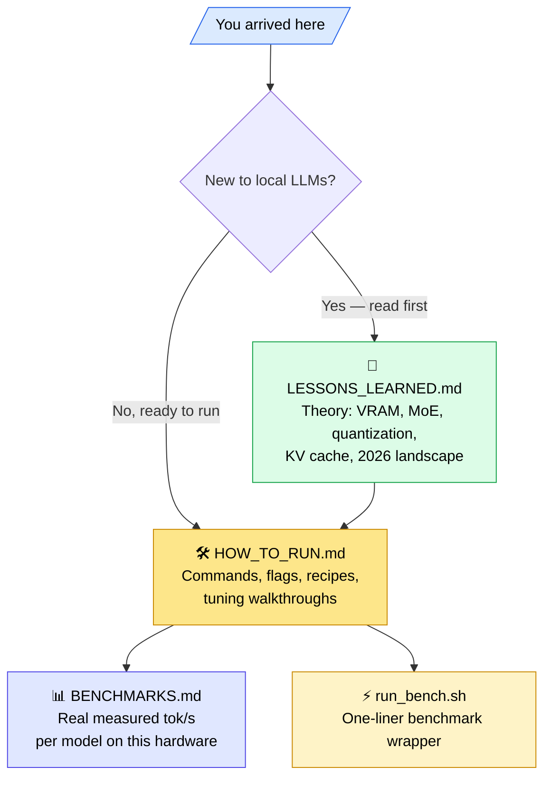

# LLM Inference on a Laptop — A Hands-On Guide

> Can a regular laptop with 8 GB VRAM run a 30B-parameter language model? Yes — and at near-chat speed. This repo shows exactly how, with measured numbers and reproducible commands.

A practical, beginner-friendly walkthrough of running modern open-weight LLMs on a single laptop, written for AI enthusiasts who want to *understand* what they're doing — not just paste commands. Every concept is explained with kitchen analogies, every flag has a one-line "why," and every speed number was measured on real hardware.

---

## Who this is for

- **Tinkerers** who just bought a gaming laptop and want to run their own ChatGPT.
- **AI engineers** sizing up local-inference setups before committing to a cloud bill.
- **Students** learning how transformers actually run on hardware (VRAM, KV cache, MoE, quantization).
- **Anyone** who's seen "70B" on a leaderboard and wondered if they could fit it on their machine.

If you're any of these, you'll get more out of this repo than yet another `ollama run` blog post.

---

## What's inside



| File | What it covers | Read when… |
|---|---|---|
| **[LESSONS_LEARNED.md](LESSONS_LEARNED.md)** | The theory tutorial — written in the spirit of the Feynman technique. Kitchen analogies for VRAM/RAM/disk, why MoE changes the game, how quantization works, what the KV cache is, the 2026 model landscape. | Start here if you're new. |
| **[HOW_TO_RUN.md](HOW_TO_RUN.md)** | The hands-on companion — every command, every flag, every error you might hit. Quick-start chat, benchmark recipes, MoE tuning walkthrough, server mode, Ollama path, troubleshooting. | When you want to actually run something. |
| **[BENCHMARKS.md](BENCHMARKS.md)** | Measured speed results on the test machine. Updated as new models are tested. | When deciding which model to download for *your* machine. |
| **[run_bench.sh](run_bench.sh)** | One-line benchmark wrapper around `llama-bench`. | When iterating on `-ngl` / `-ncmoe` settings. |

---

## The test machine

| Component | Spec |
|---|---|
| GPU | NVIDIA RTX 5060 Laptop, 8 GB VRAM, **Blackwell (sm_120)** |
| CPU | AMD Ryzen AI 9 365 (10C/20T) + Radeon 880M iGPU |
| RAM | 29 GB |
| OS | Ubuntu 26.04 (Resolute) |
| Software | CUDA 13.1, llama.cpp built from source, Ollama 0.21+ |

**Why it's interesting**: 8 GB is *small* for modern LLMs. A 30B dense model at 4-bit takes ~17 GB on its own — more than 2× the GPU. Running anything past ~8B "obviously" needs CPU offload, which is "obviously" slow… until you bring MoE models and modern offload tricks into the picture.

---

## TL;DR results

> Full table in [BENCHMARKS.md](BENCHMARKS.md). Updated as more models are added.

| Model | Size on disk | tok/s (generation) | Verdict |
|---|---:|---:|---|
| Qwen 3 8B (Q4) | 4.7 GB | **63.7** | Daily-fast baseline. Snappy chat. |
| **Qwen 3 30B-A3B MoE** (Q4) | 18 GB | **53.8** | A 30B model at 8B speeds — the headline result. |
| Phi-4-reasoning 14B (Q4) | 8.5 GB | 23.8 | Smartest dense at usable speed. |
| Qwen3.6-27B dense (Q3) | 13 GB | 7.8 | The dense penalty: 7× slower than the 30B MoE. |
| Qwen 3 8B + **TurboQuant turbo2** | 4.7 GB | **28.5 @ 32K** | **Long context unlocked** — FP16 OOMs at 32K. |

**Two punchlines in one machine:**

1. **MoE wins on tiny VRAM.** A 30-billion-parameter MoE model runs at near-chat speed on an 8 GB laptop GPU. The trick is `-ncmoe` (CPU-offloaded expert sets) — explained in [HOW_TO_RUN.md §5](HOW_TO_RUN.md).

2. **TurboQuant unlocks long context.** Stock llama.cpp can't even load Qwen 3 8B at 32K context on this laptop (FP16 KV cache busts VRAM). With [Madreag's TurboQuant fork](https://github.com/Madreag/turbo3-cuda) and `-ctk turbo2 -ctv turbo2` the same model runs at 28.5 tok/s with a 32K-token window — and the 7.5× KV compression is actually *faster* than the 5× variant at long context. Details in [BENCHMARKS.md](BENCHMARKS.md) and [HOW_TO_RUN.md §7.5](HOW_TO_RUN.md).

---

## Quick start (5 minutes)

If you have a similar laptop and want to reproduce this, here's the shortest path:

```bash
# 1. Confirm CUDA toolkit is installed
nvcc --version

# 2. Build llama.cpp with Blackwell support
git clone --depth=1 https://github.com/ggml-org/llama.cpp.git
cd llama.cpp
cmake -B build-cuda \
    -DGGML_CUDA=ON \
    -DCMAKE_CUDA_ARCHITECTURES=120 \
    -DCMAKE_CUDA_HOST_COMPILER=/usr/bin/gcc-13 \
    -DCMAKE_BUILD_TYPE=Release \
    -DLLAMA_CURL=ON
cmake --build build-cuda --config Release -j $(nproc)

# 3. Download a small model
pip install --user "huggingface_hub[cli]"
hf download unsloth/Qwen3-8B-GGUF --include "*Q4_K_M*" --local-dir qwen3-8b

# 4. Chat with it
cd build-cuda/bin
LD_LIBRARY_PATH=. ./llama-cli \
    -m ../../../qwen3-8b/Qwen3-8B-Q4_K_M.gguf \
    -ngl 99 -c 8192
```

Substitute different hardware? Most of this still works — only `CMAKE_CUDA_ARCHITECTURES` changes (look up your GPU's compute capability). Full reasoning in [HOW_TO_RUN.md](HOW_TO_RUN.md).

---

## What you'll learn (theory)

By reading [LESSONS_LEARNED.md](LESSONS_LEARNED.md) you should be able to answer:

1. *Why does my 8 GB GPU let me run a 30B model but struggle with a 14B model?* (MoE vs dense.)
2. *What's the difference between "biggest fast model" and "biggest possible model"?* (VRAM-bound vs RAM-bound.)
3. *Why do most pre-built LLM tools run slowly on a brand-new GPU?* (sm_120 kernels not compiled.)
4. *What's quantization, and why is Q4_K_M the universal default?*
5. *What is the KV cache and why does it explode at long contexts?*
6. *When does TurboQuant help me, and when is it irrelevant?*

If those don't yet feel obvious, that doc is for you.

---

## What you'll learn (practical)

By following [HOW_TO_RUN.md](HOW_TO_RUN.md) you'll be able to:

- Build llama.cpp from source for any GPU architecture
- Pick the right quantization for your VRAM budget
- Tune `-ngl` and `-ncmoe` to push a model bigger than your GPU
- Stand up an OpenAI-compatible local API server
- Diagnose the most common errors (load failures, gibberish output, CPU fallback)

---

## How this repo will grow

Planned:

- More models in [BENCHMARKS.md](BENCHMARKS.md): Phi-4-reasoning 14B, Qwen3.6-27B (dense + TurboQuant), Gemma 4 26B/4B.
- A trophy run with DeepSeek V4 Flash 284B/13B (mmap from disk — yes, on a laptop).
- Comparison column for Ollama vs raw llama.cpp on the same models.
- Notes on `--n-gpu-layers` heuristics for unfamiliar models.

If you reproduce this on different hardware, **PRs adding your numbers to BENCHMARKS.md are very welcome** — the more datapoints, the more useful the guide.

---

## Philosophy

This repo follows three rules:

1. **Numbers, not vibes.** Every claim about speed has a measurement.
2. **Why before what.** Concepts are introduced before commands. If you don't know why a flag exists, you can't tune it.
3. **The Feynman test.** If a section can't be re-explained to a beginner using only what came before it, it's rewritten.

If you find a section that fails any of these, open an issue.

---

## License & credits

Built on top of:
- [llama.cpp](https://github.com/ggml-org/llama.cpp) — the heavy lifting
- [Ollama](https://ollama.com/) — the friendly wrapper
- [Hugging Face](https://huggingface.co/) — model distribution
- Open-weight models from Alibaba (Qwen), Microsoft (Phi), Google (Gemma), and others — without whose releases none of this would be possible
