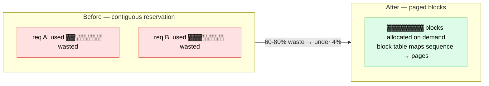
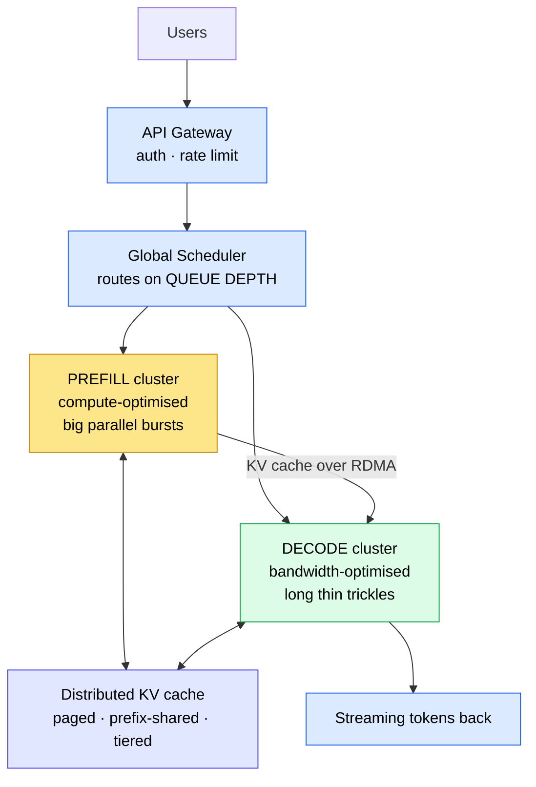

# Serving an LLM at Scale — why it's an operating-systems problem

> Training a trillion-parameter model is hard. **Serving it to a hundred million people is harder**, and for reasons that have almost nothing to do with matrix multiplication. This is the other end of the telescope from [LESSONS_LEARNED.md](LESSONS_LEARNED.md): same physics, six orders of magnitude more users.

**The punchline up front:** every major breakthrough in LLM serving since 2022 is a re-discovery of something operating systems solved in the 1960s — **paging, preemptive scheduling, copy-on-write, specialised hardware pools.** The vLLM authors say so themselves: PagedAttention is *"inspired by the classical virtual memory and paging techniques in operating systems."*

**⚠️ Claims in this document are sourced.** Where a number comes from a paper it is cited. Where it is my arithmetic it says so. There is a [claims audit](#8-a-claims-audit) at the end that corrects a widely-shared version of this story — including one figure that is wrong by two orders of magnitude.

---

## 1. The question

A production system with a 1T-parameter MoE model, 100M monthly users, 10M daily, ~8K-token prompts and ~400-token replies. **How many GPUs?**

The naive answer draws this:

```
User → API → GPU → Response
```

That is a demo. Here is why it dies.

---

## 2. Two jobs wearing one name

A model answering you does **two different jobs** with opposite resource profiles — the same split that decides whether a home cluster works ([LOCAL_CLUSTER.md §5](LOCAL_CLUSTER.md)):

| Phase | What it does | Bound by | Shape |
|---|---|---|---|
| **Prefill** | reads your whole 8K prompt at once | **compute** | one big parallel burst |
| **Decode** | writes 400 tokens, one at a time | **memory bandwidth** | a long thin trickle |

Running both on the same GPU means one of them is always wasting the machine. Prefill starves decode of compute; decode starves prefill of bandwidth. At small scale you eat it. At scale you **split the fleet in two** — see §6.

---

## 3. The memory wall

Every *active conversation* holds a **KV cache**: the model's memory of the tokens so far. It is not optional and it is not small.

```
kv_bytes ≈ 2 × layers × kv_heads × head_dim × seq_len × dtype_bytes
```

For a 70B-class model with grouped-query attention at 8K context, that lands near **2 GB per conversation** (80 layers × 8 KV heads × 128 dim × 8192 × 2 bytes × 2 ≈ 2.7 GB) — *my arithmetic, check it yourself with the calculator below.*

Now multiply:

| Concurrent conversations | KV cache needed |
|---|---:|
| 1 | ~2 GB |
| 1,000 | ~2 TB |
| **1,000,000** | **~2 PB** |

An H100 has 80 GB. Divide, and here is the number that makes the whole problem concrete:

> **One H100 holds the KV cache of about 29 conversations at 8K context.**
> Not 29 thousand. Twenty-nine — and that is before a single model weight is loaded.

A million conversations therefore needs **~33,500 H100s' worth of memory holding nothing but chat history**. That is the wall, and it is why serving is a memory-management problem before it is anything else.

Run it yourself — `kv_cache_calc.py` in this folder, stdlib only:

```bash
python3 kv_cache_calc.py --preset llama-70b --seq 8192 --concurrent 1000000
```
```
  PER CONVERSATION : 2.68 GB
  x 1,000,000 concurrent : 2.68 PB
  H100  80 GB  ->  29 conversations
```

---

## 4. PagedAttention — virtual memory, rediscovered

Before vLLM, a serving system reserved each request's **maximum possible** context up front. Ask for 32K, get 32K reserved, use 900 tokens, waste the rest.

> **Existing systems waste 60–80% of KV cache memory. vLLM wastes under 4%.**
> — *Efficient Memory Management for LLM Serving with PagedAttention*, [arXiv:2309.06180](https://arxiv.org/abs/2309.06180) (SOSP '23)

The fix is exactly what your OS does with RAM: stop requiring contiguous allocation. Chop the KV cache into fixed **blocks** (pages), keep a **block table** per sequence, and let a sequence's pages live anywhere in GPU memory.



Two things fall out for free, and both are also OS ideas:
- **Prefix caching / sharing** — identical prompt prefixes (a long system prompt, a shared document) map to the *same physical blocks*. That is copy-on-write.
- **Eviction and swapping** — cold sequences can be pushed to CPU memory and paged back. That is swap.

**What this buys: 2–4× throughput** at equal latency versus the prior state of the art (same paper). See the [claims audit](#8-a-claims-audit) — the number you may have seen quoted is much larger and wrong.

---

## 5. Continuous batching — preemptive scheduling, rediscovered

**Static batching** waits for the slowest request in the batch. One user asking for 2,000 tokens holds the whole batch hostage while everyone else's slot sits idle.

**Continuous batching** (introduced by **Orca**, OSDI '22) makes the batch *mutable at every token step*: a sequence that hits its stop token is evicted immediately, and a waiting request is admitted into the free slot and begins prefill on the very next step.

That is a run queue with preemption. The GPU stops idling between requests.

A measured comparison of two engines on the same hardware showed **GPU utilisation of 35–41% for a continuous-batching engine against 17% for one without**, with throughput of 15.20 vs 0.45 req/s at 100 concurrent users. *(Published third-party benchmark — their machines, not mine.)*

---

## 6. Disaggregation — specialised pools, rediscovered

Since prefill and decode want different hardware (§2), stop pretending they are one workload. Run **two fleets**, move the KV cache between them over a fast fabric.



This is a real, published architecture, not a whiteboard fantasy:
- **DistServe** — *Disaggregating Prefill and Decoding for Goodput-optimized LLM Serving*, [OSDI '24](https://www.usenix.org/system/files/osdi24-zhong-yinmin.pdf)
- **Splitwise** — phase splitting across specialised pools
- **Sarathi-Serve** — *chunked prefill*, taming the throughput/latency tradeoff, [OSDI '24](https://arxiv.org/abs/2403.02310)

The win is that each fleet scales **independently**: a traffic spike of long documents grows the prefill pool without buying decode bandwidth you don't need.

---

## 7. Scale on queue depth, not connections

A last inversion that catches people. Holding a user's connection open is **cheap** — network I/O costs almost nothing next to a GPU. A single well-tuned proxy sustains hundreds of thousands of idle WebSocket connections on ordinary hardware.

So **do not autoscale GPUs on connection count.** Scale on **inference queue depth** — the number of requests actually waiting for compute. Connections measure interest; queue depth measures load. Confusing the two is how a system either burns money on idle GPUs or collapses under a spike it never saw coming.

---

## 7½. Measured on one 8 GB laptop — first-party results

Everything above this point is other people's papers. This section is **ours**:
one RTX 5060 Laptop (8 GB), Gemma-3 4B Q4, `llama-server`, 16K total context split
across slots, mixed output lengths (32–512 tokens) with staggered arrivals.
Reproduce with `serving_bench.py` in this folder.

| Concurrency | Aggregate tok/s<br/>**CB / no-CB** | Per-stream tok/s<br/>(CB) | **TTFT** sec<br/>**CB / no-CB** | TTFT penalty | VRAM |
|---:|---:|---:|---:|---:|---:|
| 1 | 104.7 / 101.5 | 105.0 | 0.03 / 0.03 | — | 3815 MB |
| 2 | 99.1 / 97.4 | 101.7 | 0.03 / 0.03 | — | 3989 MB |
| 4 | 136.1 / 101.6 | 95.7 | 0.05 / 0.33 | **7×** | 4337 MB |
| 8 | 145.3 / 150.9 | 46.4 | 0.08 / 1.24 | **16×** | 5033 MB |
| **16** | **198.8** / 144.0 | 31.1 | 0.10 / 2.65 | **26×** | 5497 MB |
| 32 | 186.1 / 184.6 | 20.1 | 0.14 / **5.49** | **39×** | 5497 MB |

Four things came out of this, and one of them **corrected an earlier draft of this
very document.**

**1. Continuous batching is a LATENCY mechanism here, not a throughput one.**
Aggregate throughput with and without it is often within noise — at 32 concurrent
it is 186.1 vs 184.6. But **time-to-first-token diverges by 39×**: 0.14 s against
5.49 s. Without continuous batching a new arrival waits for the batch to drain;
with it, they join the next token step. Throughput graphs hide this completely.
The user does not feel tokens per second. They feel the wait before the first word.

**2. Batching buys ~1.9× aggregate throughput on this GPU** (104.7 → 198.8 tok/s
going from 1 to 16 concurrent streams). That is squarely in the **2–4×** range the
vLLM paper reports — and nowhere near the "10 users → 800–1000 users" claim in the
[audit](#8-a-claims-audit). Our own hardware independently contradicts it.

**3. Throughput peaks and then falls.** 198.8 tok/s at 16 concurrent, 186.1 at 32.
Past the knee you are adding contention, not capacity.

**4. The wall shows up as context, not VRAM.** Note that VRAM is *identical* at 16
and 32 concurrent — 5497 MB both times. Total KV cache is fixed by `-c 16384`, so
doubling the slots does not consume more memory, it **halves the context each user
gets**: 1024 tokens each at 16 slots, 512 at 32. This is the memory wall in its
everyday form on a small machine. You do not run out of VRAM; you run out of
*conversation* — which is exactly the waste PagedAttention exists to reclaim.

> **The honest headline for this hardware:** one 8 GB laptop GPU serves roughly
> **16 concurrent users** at ~31 tok/s each with sub-100 ms first-token latency.
> Push to 32 and each user drops to 20 tok/s with half the context. That is the
> real shape of the curve, measured, on hardware anyone can buy.

### A test-design failure worth publishing

The first version of this experiment sent **identical requests, all at once**, and
measured **no difference at all** between `-cb` and `-nocb`. I nearly reported that
as a null result.

It was a null result about the *workload*, not about batching. Static batching's
penalty is waiting for the slowest request in the batch — and if every request is
the same length and arrives at the same instant, there is no slowest one. The test
structurally could not observe the thing it existed to measure.

Mixed lengths plus staggered arrivals — i.e. traffic that looks like traffic —
made the effect appear immediately, and it was large. **A benchmark that cannot
see the effect returns a clean, confident, meaningless number.**

---

## 8. A claims audit

A widely-shared version of this story circulates on social media. Most of it is right. **One number is wrong by two orders of magnitude**, and a couple more need labelling. Since the whole point of this repo is checkable numbers, here is the audit.

| Claim | Verdict |
|---|---|
| Systems waste 60–80% of KV cache | ✅ **True** — arXiv:2309.06180 |
| PagedAttention cuts waste to <4% | ✅ **True** — same paper |
| ~2 GB KV cache per session at 8K | ✅ **Fair** — my arithmetic gives ~2.7 GB for a 70B/GQA model |
| 1M sessions ≈ 2 PB of KV cache | ✅ **Arithmetic holds** |
| Continuous batching lifts utilisation a lot | ⚠️ **Refined by our own test.** On our GPU it barely moves aggregate throughput — but it improves **time-to-first-token by up to 39×** (§7½). It is a latency mechanism, and describing it as a throughput multiplier misses the point. |
| Prefill/decode run as separate clusters | ✅ **Real** — DistServe, Splitwise |
| **"A GPU that served ~10 users now serves 800–1000"** | ❌ **WRONG.** The paper reports **2–4×** throughput. This confuses *memory-waste reduction* with *throughput gain*. You cannot get 100× more users by reclaiming 80% of one resource — there is not 100× of it to reclaim. |
| "40–50% → 90%+ utilisation" | ⚠️ **Unsourced specifics.** Direction right, exact numbers not supported by anything I could find. |
| "10,000–20,000 H100s for 1M users" | ⚠️ **Arithmetic, not measurement.** Reasonable from ~50–100 streams/GPU, but label it as arithmetic. |

The real numbers are extraordinary. **2–4× throughput and 80% → 4% waste are landmark results.** They do not need inflating, and inflating them is how a good explanation loses its credibility.

---

## 9. Your 8 GB laptop is this exact problem

Nothing above is foreign to the rest of this repo — it is the same fight at 1/100,000 scale:

| On one laptop | At hyperscale |
|---|---|
| `-ncmoe` offloads sleeping experts to system RAM | Tiered / hierarchical KV cache |
| KV cache quantisation to fit 32K context | KV compression |
| One request at a time, GPU idle between them | Continuous batching |
| `--fit off` so the server doesn't eat the pool | Block-level memory management |
| Prefill is fast, decode crawls | Prefill/decode disaggregation |

If you have run a model on a single GPU and watched the KV cache eat your VRAM, **you have already met every problem in this document.** The hyperscalers just met it with a hundred thousand GPUs and had to name the solutions.

---

## See also

- **[LESSONS_LEARNED.md](LESSONS_LEARNED.md)** — the theory: VRAM, MoE, quantisation, KV cache
- **[LOCAL_CLUSTER.md](LOCAL_CLUSTER.md)** — the middle scale: choosing a home cluster, prefill vs decode, why the wire decides
- **[BENCHMARKS.md](BENCHMARKS.md)** — measured tok/s on one laptop
