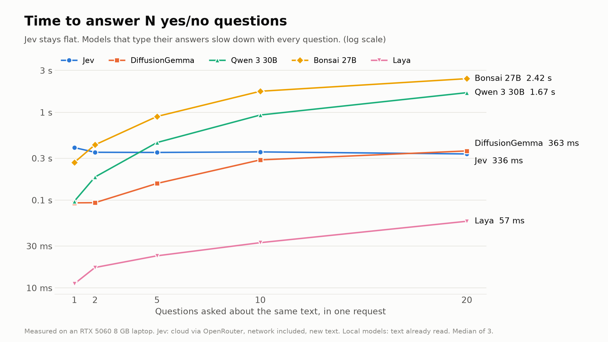
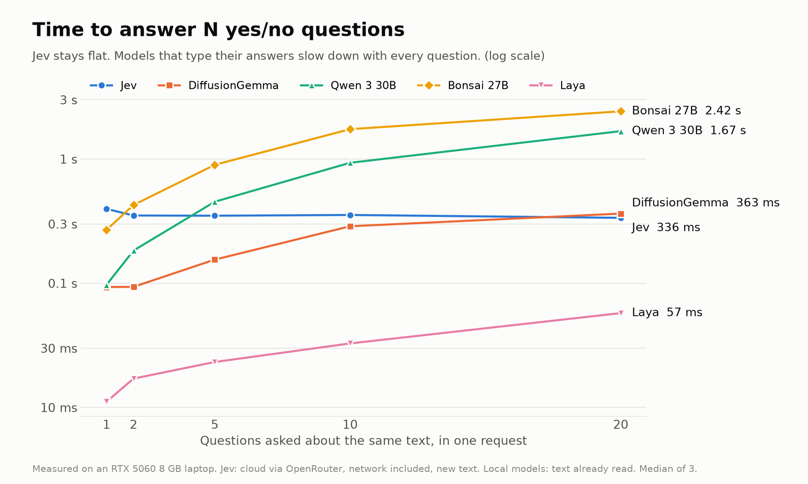
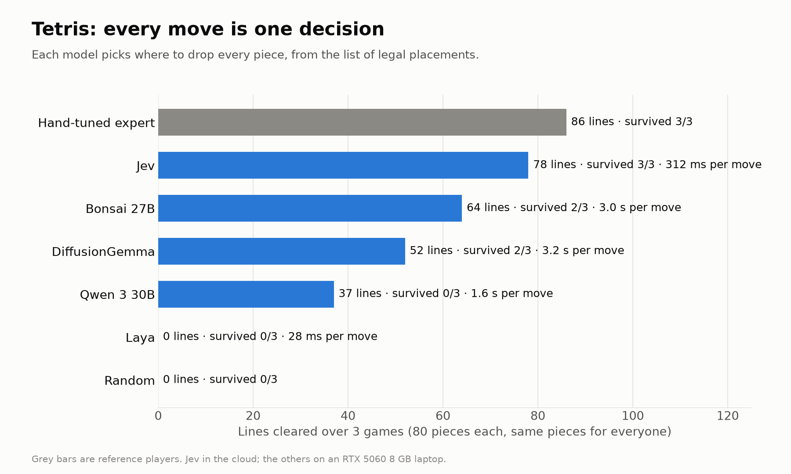

# I Tested Jev Against 4 Open Models on My 8 GB Laptop. Speed Isn't the Whole Story.

*A LinkedIn article, ready to copy. Publishing steps: [social/README.md](../../../README.md#publishing-a-linkedin-article). The full benchmark it summarises: [DIFFUSIONGEMMA.md](../../../../DIFFUSIONGEMMA.md).*

## Cover image



> 📎 **Upload as the cover:** `images/cover-1920x1080.png` (1920 × 1080, LinkedIn's recommended size) · **Alt text:** Line chart showing Jev answering 1 to 20 questions in a flat 0.34–0.40 s, while models that type their answers slow down with every question.

## Title

```text
I Tested Jev Against 4 Open Models on My 8 GB Laptop. Speed Isn't the Whole Story.
```

## Body

---

Everyone is talking about **Jev**, TypeSafe AI's "System One" decision model. You send it some text and a few typed questions — yes/no, pick one of these options, score from 1 to 5 — and it sends back a probability for every option. No text to parse, "70–500 ms", and output tokens are free.

Then a viral post claimed Google's open **DiffusionGemma** can do the same thing: a free Jev you can run yourself, "~0.2 s flat", "zero hallucinations".

I wanted numbers, not vibes. So I put five models through the same tests:

- **Jev 1.13** — the real thing, called in the cloud through OpenRouter
- **DiffusionGemma 26B** — Google's open text-diffusion model, run as an open Jev clone on my laptop
- **Qwen 3 30B** — a normal chat model, as the baseline
- **Ternary Bonsai 27B** — a 27B model squeezed to 1.75 bits per weight, a 5.9 GB file
- **Laya** — a tiny open-source "Jev alternative", a 421M-parameter classifier

Everything local ran on one laptop: an RTX 5060 with 8 GB of VRAM.

## First, the idea in 60 seconds

A normal language model answers a question the way you'd fill in a form with a typewriter: it types "q1: yes" one character at a time, and then your code has to read what it typed. Sometimes it types "yes: yes" instead, and your code breaks.

A **System One read** hands the model a form that's already printed, with only the answer boxes blank. The model looks at the whole form at once and tells you how likely each option is for each box. Nothing is typed. Nothing is parsed. And ten boxes cost barely more than one, because they're all filled in the same pass.

That's the whole pitch. The question is whether it holds up.

## The tests

- **400 labelled questions**: 200 movie reviews ("is this positive?") and 200 news articles ("World, Sports, Business or Sci/Tech?"). These come from two public benchmark datasets, SST-2 and AG News, so every answer can be marked automatically.
- **A speed test**: ask 1, 2, 5, 10 and 20 questions about the same article, in one request.
- **Tetris**: every move is one decision — the model sees the board and picks where to drop the piece from the list of legal placements. Same pieces for everyone, three games each.

## Speed: Jev's claim is real



> 📎 **Upload:** `images/speed-by-question-count.png` · **Alt text:** Line chart of time to answer 1, 2, 5, 10 and 20 yes/no questions about one text, log scale. Jev stays flat at 0.34–0.40 s. DiffusionGemma rises from 0.09 to 0.36 s, Qwen 3 30B from 0.10 to 1.67 s, Bonsai 27B from 0.27 to 2.42 s, and Laya from 11 to 57 ms. · **Caption:** Jev stays flat from 1 to 20 questions. Models that type their answers slow down with every question. Measured on an RTX 5060 8 GB laptop; Jev in the cloud, network included.

**Jev answered in 0.34–0.40 seconds whether I asked 1 question or 20** — and that includes the round trip over the internet from Türkiye. That's the headline promise, and it holds.

The models that have to *type* their answers slow down with every question: Qwen goes from 0.10 s to 1.7 s, Bonsai from 0.27 s to 2.4 s — and at 20 questions, both broke the output format they'd been asked for.

DiffusionGemma fills every answer box in one pass: 0.09 s for one question, 0.36 s for twenty, once it has read the text. On my laptop, though, *reading a new text* is the slow part (0.5–2 s), because most of this 26B model sits in system RAM. Jev's datacentre hardware hides that; an 8 GB laptop can't.

And the fastest of all by far was **Laya: 11 ms for one question, 57 ms for twenty** — about 35× faster than Jev. It's a small classifier, not a 26–30B model. Hold that thought.

## Tokens and cost

- Qwen and Bonsai have to write their answers: about 5 output tokens per question, 72–92 for twenty.
- DiffusionGemma and Laya write nothing at all: **0 output tokens**. The answer is read straight out of the model as probabilities.
- Jev bills input tokens only, at $0.042 per million. **My entire 400-question test cost $0.0056** — about $0.014 per 1,000 decisions.
- The local models cost me nothing beyond electricity.

## Quality: the surprise wasn't the diffusion model


> 📎 **Upload:** `images/accuracy-400-questions.png` · **Alt text:** Grouped bar chart of accuracy on 200 movie reviews and 200 news articles. Jev 94.0% and 85.0%; Bonsai 27B 92.5% and 86.5%; Laya 92.0% and 94.0% (reviews asked as a choice, news in its training data); DiffusionGemma 89.0% and 77.0%; Qwen 3 30B 83.0% and 65.5%. · **Caption:** Accuracy on the same 400 questions. Laya's news score is on data it was trained on; asked as yes/no, it scored 46% on reviews.

- **Jev: 94 % on movie reviews, 85 % on news topics**, and well calibrated — when it says 90 %, it's usually right about 90 % of the time.
- **Ternary Bonsai 27B: 92.5 % / 86.5 %**, zero broken replies, and the *best* calibration of all five. It beat Jev on news topics — from a 5.9 GB file running entirely on a laptop GPU.
- **DiffusionGemma: 89 % / 77 %**, zero broken replies. Solid, but 5–8 points behind Jev.
- **Qwen 3 30B, typing its answers: 83 % / 65.5 %**, with **31 malformed replies out of 400** — it was told to answer "q1: D" and wrote "D: D" or "B: Sports" instead.
- **Laya** is the complicated one. Asked the same yes/no question as everyone else, it answered "no" to every single review — 46 %, worse than a coin flip, at 99.99 % confidence. Asked as a two-option choice instead ("negative or positive?"), the same model scored 92 %. Its 94 % on news doesn't count: its own benchmark code says AG News was in its training data.

One lesson stood out above all the others: **every model stopped producing broken replies the moment I read its probabilities instead of parsing its text.** That trick works on any model — even a normal chat model like Qwen. You don't need diffusion for it.

## Tetris: can they actually play?



> 📎 **Upload:** `images/tetris-results.png` · **Alt text:** Bar chart of Tetris lines cleared over 3 games. Hand-tuned expert 86, Jev 78 (survived 3 of 3, 312 ms per move), Bonsai 27B 64 (2 of 3, 3.0 s), DiffusionGemma 52 (2 of 3, 3.2 s), Qwen 3 30B 37 (0 of 3, 1.6 s), Laya 0 (0 of 3, 28 ms), Random 0. · **Caption:** Tetris, where every move is one decision. Same pieces for every player; 3 games of 80 pieces each.

A decision benchmark with consequences: a bad move makes the next one harder.

- **Jev survived all three games, cleared 78 lines, and matched a hand-tuned expert's move 88 % of the time**, at 0.3 s per move. For comparison, the expert cleared 86.
- **Bonsai** survived 2 of 3 (64 lines) and **DiffusionGemma** 2 of 3 (52 lines), at about 3 s per move on the laptop.
- **Qwen** never broke format, but chose worse moves and topped out in all three games.
- **Laya** cleared zero lines — barely better than random — though each move took just 28 ms. Weighing "+2 holes, max height 6" against the alternatives is reasoning, and a small classifier doesn't do it.

## So is DiffusionGemma "a free Jev"?

Half true.

It genuinely does what the viral post describes: one pass over a pre-printed form, zero output tokens, many answers at once. I built an open-source llama.cpp backend so it runs on an 8 GB GPU, and it works.

But on consumer hardware it isn't "0.2 s flat", it's 5–8 points less accurate than Jev, and — this is the part people skip — it doesn't eliminate hallucinations. It eliminates *format errors*. It still got 11–23 % of answers wrong, sometimes while claiming 99.99 % confidence. Jev, on the same two ambiguous news stories, said 0.82 and 0.55 — honest doubt.

(And for the record: TypeSafe hasn't said what Jev is built on. Its flat latency tells us it answers in one pass, but that could be a diffusion model, a classifier, or something else. Nobody outside TypeSafe knows.)

## What I'd actually use

- **You want the fastest, most accurate decisions and a cloud API is fine:** Jev. Flat ~0.35 s, best on reviews, most honest about uncertainty, and it costs almost nothing.
- **Decisions must stay on your own hardware:** Ternary Bonsai 27B, reading its probabilities rather than parsing its text. 5.9 GB, fits an 8 GB GPU, about as accurate as Jev on these tasks. Slow only if it has to type many answers.
- **Many questions about the same text, locally:** DiffusionGemma. Its one-pass reads are where it genuinely shines.
- **Millions of decisions on well-defined, familiar tasks:** Laya — but only after testing it on *your* questions. It's astonishingly fast and silently wrong outside its comfort zone.
- **Chat, writing, code:** none of the above. Use a normal model.

## Everything is open

The full write-up — every test case, the exact prompts and questions each model got, raw results, the llama.cpp backend, the Tetris engine, and a beginner-friendly explainer of how all of this works — is on GitHub:

https://github.com/beyhanmeyrali/all-about-ai/blob/main/llm-inference/DIFFUSIONGEMMA.md

If you run it on different hardware, or have a model you'd like to see in the next round, I'd love to hear about it.

#AI #LLM #Jev #DiffusionGemma #LocalLLM #OpenSource #MachineLearning
